# DPF Pod-to-Pod Acceleration Benchmark Report

**Status:**
- **Test Set 1** (Cilium passthrough ↔ VPC-OVN accelerated) — complete, n=4
- **Test Set 2** (VPC-OVN hw-offload off ↔ on, apples-to-apples) — complete, n=4
- **Test Cases 3 & 4** (HBN/ECMP) — **complete** (MTU 9000 on `dpf-ovn-hbn`). 4/4 eBGP uplinks Established, single pod-pair ~37 Gbps, **4-uplink aggregate ~77 Gbps**, sub-second uplink failover. See [§ 7](#7-test-cases-3--4--ovnhbn-bgpecmp-results).

**Date:** 2026-05-13 (Test Set 2 + HBN underlay added 2026-05-13; Test Set 1 results from 2026-05-08)
**Authors:** DPF testing team
**Source data:** `results/dpf-ovn-baseline/` (Test Set 1 baseline), `results/dpf-ovn-accelerated/` (Test Set 1 cluster B + Test Set 2 accelerated arm), `results/dpf-ovn-accelerated-no-offload/` (Test Set 2 baseline)
**Charts:** `results/charts/`
**Companion docs:** [`STACK_EXPLANATION.md`](STACK_EXPLANATION.md) (full stack details), [`FABRIC_HBN_ECMP_REQUEST.md`](FABRIC_HBN_ECMP_REQUEST.md) (first fabric ask), [`FABRIC_HBN_SECOND_PEERING_REQUEST.md`](FABRIC_HBN_SECOND_PEERING_REQUEST.md) (second ask, complete)

---

## 1. Executive Summary

Two pod-to-pod cluster configurations were benchmarked head-to-head on identical hardware:

- **Cluster A — `dpf-ovn-baseline`** (passthrough): the BlueField-3 DPU is configured as a wire; OVN runs on the host kernel.
- **Cluster B — `dpf-ovn-accelerated`** (VPC-OVN): the OVN dataplane is offloaded to the DPU's OVS-DOCA engine. Pod traffic traverses scalable functions on the DPU and rides geneve over the 40 Gb/s fabric between the two BlueField-3s.

The full benchmark matrix from `POD_TO_POD_TEST_PLAN.md` § "Benchmark Matrix" was run on both clusters: **11 tests × 5 runs × 60 s** (run 1 discarded as warmup; all numbers below are mean ± stdev over runs 2–5, n=4). All tools (iperf3, netperf, sockperf, mpstat) ran **inside the pod containers** on the DPU tenant cluster.

### Headline results

| Metric | Passthrough (A) | VPC-OVN (B) | Change |
|---|---:|---:|---:|
| TCP single-stream throughput | 20.5 ± 0.3 Gbps | 27.1 ± 4.0 Gbps | **+33 %** |
| TCP 8 / 16-stream throughput | 39.4 Gbps (line rate) | 39.4 Gbps (line rate) | — |
| **TCP request/response rate** | 8 543 round-trips/s | 23 472 round-trips/s | **+175 %** |
| **TCP connection rate** | 1 392 conn/s | 5 370 conn/s | **+286 %** |
| **sockperf p99.9 tail latency** | 963 µs | 104 µs | **−89 %** |
| Host CPU at line rate (8/16 streams) | 21 % busy | 5 % busy | **−77 %** |

The story isn't that throughput went up — at the per-link fabric ceiling of 40 Gb/s both arms were already saturated. The story is **the DPU does the dataplane work, freeing host cores**, and at the same time delivers **much faster transactions and tighter tail latency** because the per-packet path skips host softirq.

---

## 2. Test Environment

### 2.1 Hardware

| Component | gpu1 | gpu2 |
|---|---|---|
| Host chassis | Supermicro SYS-4028GR-TR2 (X10 family, 4U GPU server) | same model |
| Host motherboard | Supermicro X10DRG-O+-CPU rev 1.00, BIOS AMI v3.2 (2019-12-13) | same |
| Host CPU | 2× Intel Xeon E5-2678 v3 (Haswell-EP, 12c/24t per socket, 2.5/3.6 GHz, μcode 0x43) — **48 threads total**, 2 NUMA nodes | same |
| Host memory | 251 GiB DDR4-2133 ECC RDIMM (8 of 24 DIMM slots populated, Samsung M386A4G40DM0-CPB) | same |
| Host PSU | 2× Supermicro PWS-2K05A-1R 2 kW (redundant 1+1) | same |
| Host GPUs (installed but unused for this test) | 2× NVIDIA Quadro RTX 6000/8000 (TU102GL) — present, not exercised | same |
| Host BMC | Supermicro IPMI, firmware 3.86, ASPEED VGA | same |
| **BlueField-3 DPU** | NVIDIA B3220 P-Series FHHL (part 900-9D3B6-00CV-A_Ax), PSID `MT_0000000884` | same |
| DPU serial | `MT24326005FN` | `MT2439600DAK` |
| DPU SoC | 16× Arm Cortex-A78AE (aarch64) | same |
| DPU on-board RAM | 32 GiB DDR (ECC) | same |
| DPU on-board storage | 38.9 GB eMMC + 119.2 GB Toshiba KBG40ZPZ128G NVMe (M.2) | same |
| DPU firmware | NIC FW 32.47.1088, UEFI 14.40.0010, PXE 3.8.0201 | same |
| DPU OS / kernel | DOCA Ubuntu 24.04.3 LTS / 6.8.0-1013-bluefield-64k (64 KB pages) | same |
| DPU OVS-DOCA | 3.2.1005, DB schema 8.5.1 | same |
| DPU integrated BMC | OpenBMC BF-25.10-15 (build 2025-12-09) at 172.16.30.36 | at 172.16.30.33 |
| DPU PCIe slot in host | CPU1 SLOT10 | same |
| PCIe link host ↔ BF3 | x16 @ 8 GT/s (Gen3 — downgraded from BF3-native Gen5; host root complex is Gen3) | same |
| **DPU `p0` — 40 G fabric port 0** | host-side `enp14s0f0np0`, DPU-side `p0` (DPDK), MAC `c4:70:bd:2b:f6:a2`, MTU 9216, **carries VPC-OVN geneve underlay** in Test Sets 1 & 2 | host-side `enp14s0f0np0`, DPU-side `p0`, MAC `c4:70:bd:f0:65:d6` |
| **DPU `p1` — 40 G fabric port 1** | host-side `enp14s0f1np1`, DPU-side `p1`, MAC `c4:70:bd:2b:f6:a3`, MTU 9216 — **brought up for HBN underlay testing**, routed `/31` with BGP to leaf | host-side `enp14s0f1np1`, DPU-side `p1`, MAC `c4:70:bd:f0:65:d7` |
| Mgmt NIC (1 G OOB) | Intel I350 dual-port (`enp129s0f0/f1`), IP 172.16.30.90 on f0 | IP 172.16.30.253 |
| Secondary mgmt NIC (10 G copper) | Intel X540-AT2 (`ens1f0`), upstream lab connectivity / image pulls — not on bench data path | same |
| Host BMC IP | (Supermicro IPMI on `enp129s0f0` mgmt LAN) | same |
| DPU BMC IP | 172.16.30.36 | 172.16.30.33 |
| DPU OOB IP (post-install, on `oob_net0`) | 172.16.30.29 | 172.16.30.20 |
| **DPU `ovnvtep` (geneve src in VPC-OVN)** | 172.16.97.98/27 (OVS internal port on `br-ovn-ext`) — VLAN 497 underlay | 172.16.97.102/27 |
| **DPU `p1` /31 IP (HBN underlay, Test Set 3 prep)** | `172.16.97.249/31` ↔ leaf `172.16.97.248/31` on Eth1/24 | `172.16.97.251/31` ↔ leaf `172.16.97.250/31` on Eth1/26 |
| **DPU BGP ASN (HBN underlay)** | 65010 (eBGP to leaf AS 65001) | 65020 |

#### Fabric switch wiring

| Switchport on `custeng.leaf1.1` (Cisco Nexus, NX-OS 9.3(11)) | Connects to | Config | Status |
|---|---|---|---|
| **Eth1/23** | gpu1 DPU `p0` | `switchport access vlan 497` (`dpf-dummy-fabric`), MTU 9216 | up, carrying VPC-OVN geneve underlay |
| **Eth1/24** | gpu1 DPU `p1` | `no switchport`, `ip address 172.16.97.248/31`, MTU 9216; eBGP neighbor `172.16.97.249` remote-as 65010 | up, BGP Established (123 prefixes received from leaf) |
| **Eth1/25** | gpu2 DPU `p0` | `switchport access vlan 497`, MTU 9216 | up, carrying VPC-OVN geneve underlay |
| **Eth1/26** | gpu2 DPU `p1` | `no switchport`, `ip address 172.16.97.250/31`, MTU 9216; eBGP neighbor `172.16.97.251` remote-as 65020 | up, BGP Established |
| Cable type (all four) | QSFP-H40G-AOC15M (40 Gb/s active optical) | — | — |
| Leaf loopback (advertised via BGP to each DPU) | — | `11.0.0.111/32` | reachable from each DPU at ~0.5 ms RTT |

### 2.2 Software

- DPF: v25.10.1 (Zero Trust mode, NetOp v2 profile)
- Kubernetes: host cluster v1.33.6; tenant cluster v1.33.6 (kamaji-managed)
- Host CNI (host cluster): Cilium v1.18.4 (eBPF)
- DPU pod CNI (tenant cluster, default): Flannel; **secondary network on `bench-net` via Multus + OVS CNI + nv-ipam** (this is the VPC-OVN net1 interface used by the bench pods)
- DPU OS: DOCA Ubuntu 24.04.3 LTS, kernel 6.8.0-1013-bluefield-64k (64 KB pages)
- DPU OVS-DOCA: 3.2.1005, DB schema 8.5.1
- DPU DOCA libraries: 3.2.1025-1
- **FRR 8.4.4 installed on each DPU** for HBN-underlay validation (eBGP on `p1` to leaf — does **not** participate in bench data path; see [§ 2.4](#24-what-was-held-constant-between-arms) "fabric state additions between runs")
- Bench tools: iperf3 3.16, netperf 2.7.1, sockperf 3.10, sysstat (mpstat) 12.6.x — all installed inside the pod via the Ubuntu universe repo

### 2.3 Topology

Both clusters use the **same physical hardware**. Only the cluster profile and where the dataplane runs differ. In every arm the bench traffic crosses the **40 G fabric** between gpu1 and gpu2; what changes is **whose CPU does encapsulation / decapsulation / conntrack / forwarding**.

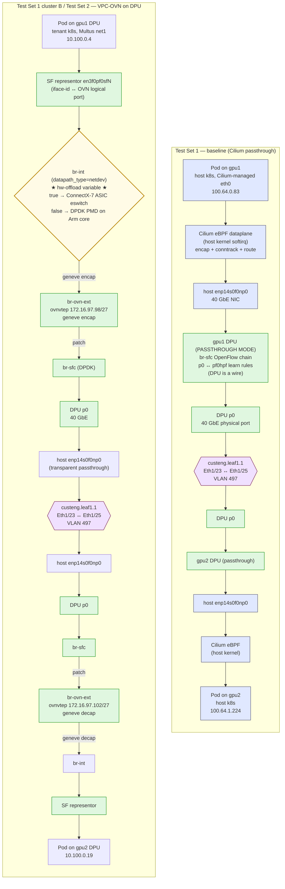

**Test Set 1 (A vs B)** changes where the dataplane lives — host kernel Cilium-eBPF vs DPU OVS-DOCA. **Test Set 2 (B-hw-off vs B-hw-on)** is the highlighted yellow `br-int` block in arm B: same path top-to-bottom, only `other_config:hw-offload` toggled.

### 2.4 What was held constant between arms

#### Across both test sets (constant in every run, every arm)

| Item | Held constant |
|---|---|
| Hardware (servers, DPUs, fabric switch, cables) | ✓ |
| Host BIOS, microcode, kernel, sysctls — no perf tuning applied | ✓ |
| Fabric L2 / VLAN 497 / MTU 9216 on `Eth1/23` (gpu1.p0) and `Eth1/25` (gpu2.p0) | ✓ |
| Cable type (QSFP-H40G-AOC15M, 40 Gb/s) | ✓ |
| DPU firmware (NIC FW 32.47.1088, UEFI 14.40.0010), DOCA Ubuntu 24.04, OVS-DOCA 3.2.1005 | ✓ |
| Benchmark commands & parameters (verbatim from runner script) | ✓ |
| Run count (5), warmup discard (run 1), inter-run idle (30 s) | ✓ |
| Bench tool versions (iperf3 3.16, netperf 2.7.1, sockperf 3.10, mpstat 12.6) | ✓ |

#### Test Set 1 (Cilium baseline ↔ VPC-OVN HW)

| Item | Test Set 1 cluster A | Test Set 1 cluster B |
|---|---|---|
| Cluster profile | `dpf-ovn-baseline` (Passthrough) | `dpf-ovn-accelerated` (VPC-OVN) |
| Pod CNI | Cilium eBPF on host kernel | Flannel + VPC-OVN as Multus secondary |
| Pod CIDR | `100.64.0.0/16` (Cilium) | `10.100.0.0/24` (VPC-OVN via nv-ipam) |
| Where the pods run | host k8s cluster | DPU tenant k8s cluster (kamaji) |
| Where the dataplane runs | host kernel softirq | DPU OVS-DOCA, HW-offloaded into ConnectX-7 |
| DPU operating mode | passthrough (p0↔pf0hpf learn chain only) | VPC-OVN (br-int, br-ovn-ext, br-sfc all active) |

#### Test Set 2 (VPC-OVN sw ↔ VPC-OVN HW — apples-to-apples)

| Item | Test Set 2 baseline | Test Set 2 accelerated |
|---|---|---|
| Cluster | same `dpf-ovn-accelerated` | same |
| Pod spec, image, MAC, IP | same `bench-client-vpc` (10.100.0.4) ↔ `bench-server-vpc` (10.100.0.19) | same |
| DPU OVS bridges, OVN logical switch, geneve tunnel endpoints | same | same |
| SF representor that each pod attaches to | same `en3f0pf0sfN` per DPU | same |
| `Eth1/23 ↔ Eth1/25` VLAN 497 path | same | same |
| **OVS `other_config:hw-offload`** | **`false`** | **`true`** |

In Test Set 2, only one Open_vSwitch column changes. No pod recreation, no NAD change, no DPU reboot, no firmware change, no cluster redeploy.

#### Fabric state additions between runs (not on the bench data path)

These switch ports and DPU interfaces were configured **between** Test Set 1 and Test Set 2 to prepare for HBN testing (TC3/TC4 — see § 7). They do **not** affect the benchmark numbers because the bench traffic continues to ride only the `Eth1/23 ↔ Eth1/25` VLAN 497 path on each DPU's `p0`.

| Added item | Where | Purpose | Used by bench traffic? |
|---|---|---|---|
| `Eth1/24` routed `/31` (`172.16.97.248/31` ↔ gpu1.p1 `172.16.97.249/31`) on the leaf | `custeng.leaf1.1` | HBN underlay path #1 for gpu1 | **No** — separate from VPC-OVN's VLAN 497 path |
| `Eth1/26` routed `/31` (`172.16.97.250/31` ↔ gpu2.p1 `172.16.97.251/31`) | `custeng.leaf1.1` | HBN underlay path #1 for gpu2 | **No** |
| eBGP on each DPU's `p1` (FRR 8.4.4, AS 65010 gpu1 / AS 65020 gpu2 ↔ leaf AS 65001) | gpu1/gpu2 DPU OS | Validate fabric end-to-end for HBN deploy | **No** — only carries 123 prefixes from leaf and the test loopback `11.0.0.111/32` |
| Hugepages `vm.nr_hugepages=4` (4 × 512 MB = 2 GB) on each DPU | DPU OS | Required for OVS-DOCA / DPDK to start | Yes — applied at setup, identical in both Test Set 2 arms |

**Net effect on the benchmark:** the bench data path is `pod → SF → br-int → br-ovn-ext (ovnvtep .98/.102) → geneve → br-sfc → p0 → Eth1/23 ↔ Eth1/25 → mirror on the other side`. None of the new `p1` / `/31` / BGP state participates in that path. The DPU still has its full attention on the VPC-OVN dataplane during the run; FRR is a small userspace process with negligible CPU.

---

## 3. Methodology

### 3.1 Benchmark matrix

All eleven tests below were run on both clusters using the script `scripts/run_pod_accelerated.sh` (and its baseline twin `scripts/run_pod_baseline.sh`). Each command ran for 60 s, repeated 5 times, with run 1 discarded as warmup and 30 s idle between runs.

| # | Tool | Command | Measures |
|---|---|---|---|
| 1 | iperf3 | `-c <ip> -t 60 -B <client_ip> --json` | TCP throughput, single stream |
| 2 | iperf3 | `-c <ip> -t 60 -B <client_ip> -P 8 --json` | TCP throughput, 8 parallel streams |
| 3 | iperf3 | `-c <ip> -t 60 -B <client_ip> -P 16 --json` | TCP throughput, 16 parallel streams |
| 4 | iperf3 | `-c <ip> -u -b 0 -t 60 -B <client_ip> --json` | UDP send rate (max) and receiver loss% |
| 5 | iperf3 | `-c <ip> -u -b 0 -l 64 -t 60 --json` | UDP small-packet (PPS-bound) |
| 6 | iperf3 | `-c <ip> -u -b 0 -l 1400 -t 60 --json` | UDP MTU-sized packets |
| 7 | netperf | `-H <ip> -t TCP_RR -l 60` | TCP request/response rate |
| 8 | netperf | `-H <ip> -t UDP_RR -l 60` | UDP request/response rate |
| 9 | netperf | `-H <ip> -t TCP_STREAM -l 60 -- -m 1` | Small-message TCP stream |
| 10 | sockperf | `ping-pong -i <ip> -p 11111 -t 60 --full-rtt` | Tail latency (p50/p99/p99.9) |
| 11 | netperf | `-H <ip> -t TCP_CRR -l 60` | TCP connection rate (conntrack stress) |

### 3.2 Supplementary captures

For each run on each cluster:
- `mpstat -P ALL 1 62` inside the pod container (per-core CPU as the pod sees it)
- `mpstat -P ALL 1` continuously on the **host** (gpu1 and gpu2), then sliced to the 60 s window per test by `scripts/slice_host_mpstat.sh` — this is what shows the host CPU savings

### 3.3 VPC-OVN attachment plumbing (cluster B)

Pods on cluster B got their VPC-OVN net1 interface via:

1. `DPUVPC` named `bench-vpc` (`isolationClassName: ovn.vpc.dpu.nvidia.com`)
2. `DPUVirtualNetwork bench-net` (Bridged, `subnet: 10.100.0.0/24`, dhcp)
3. nv-ipam `IPPool` for the same /24
4. NetworkAttachmentDefinition with `type: ovs, bridge: br-int, interface_type: dpdk, ipam: nv-ipam`
5. Pod resource request `nvidia.com/bf_sf: 1` (an SF allocated by the SR-IOV device plugin)
6. **Manual OVN logical switch port creation** with the pod's MAC + IP and `requested-chassis: <DPU-node-name>` (the `vpc-ovn-node` controller binds via `ServiceInterface` CRs; raw NAD-attached pods don't auto-bind, so we did it manually)
7. **Manual `iface-id` setting** on each DPU's OVS port (`external_ids:iface-id=<lsp-name>`) so OVN-controller binds the port and installs flows. After this, `external_ids:ovn-installed=true` confirms the binding.

Once steps 6 & 7 land, traffic from the pod's net1 enters the DPU's br-int with hardware-offloaded flows.

---

## 4. Results — Throughput

### 4.1 TCP and UDP throughput

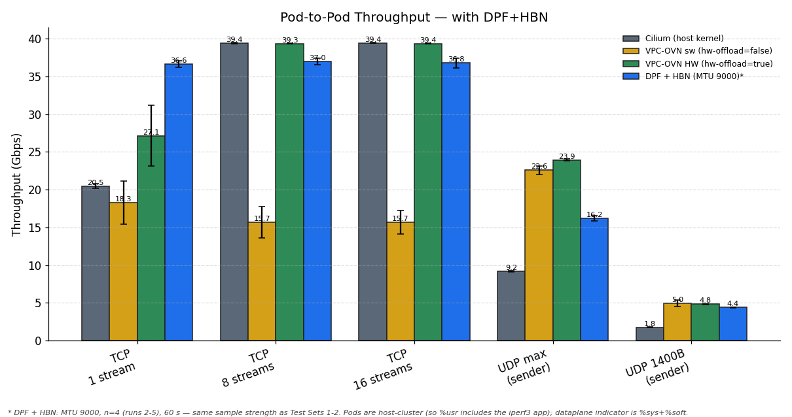

> The blue **DPF + HBN** bar (MTU 9000) is overlaid for reference; see § 7 for its full results and the methodology caveat (footnoted on the chart).

- **TCP 1-stream**: VPC-OVN +33 %. Single-stream pinned to one host core in the passthrough arm; the DPU pipeline is faster than that core for encap/decap/conntrack.
- **TCP 8-stream and 16-stream**: both arms saturate the 40 Gb/s wire (39.4 Gbps). No throughput delta. **The win here is in CPU usage** — see § 5.
- **UDP sender (max bandwidth)**: VPC-OVN +160 %. The DPU's hardware path can transmit UDP much faster than the host kernel.
- **UDP 1400 B and 64 B sender**: similar +168–171 % gains. TX-side offload is doing real work.

> **Note on the HBN bar (UDP max ~16 Gbps vs VPC-OVN ~24).** The gap is a *sender-side* artifact of pod placement, not the fabric. HBN bench pods are host-cluster: a single-threaded `iperf3 -u -b 0` sends through one host SR-IOV VF TX queue serviced by one CPU softirq core, which caps the host x86 kernel UDP-send path at ~16 Gbps. T1/T2 pods ran on the DPU Arm via the leaner SF representor path (~24 Gbps single-thread). Both are receiver-bound anyway (§ 4.2) — HBN's 42 % loss and T2's ~50 % loss leave their effective received rates much closer than the sender bars suggest.

### 4.2 UDP loss explained

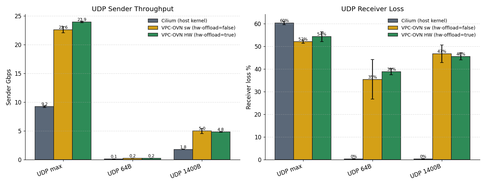

UDP loss% is *similar in both arms* (~50–60 % at high send rates). This is **expected and not a fabric problem**:

- iperf3 UDP receive is single-threaded — one process draining one UDP socket.
- All packets in a single 5-tuple flow land on one RX queue → one host CPU core.
- That core saturates around 8–12 Gbps for software UDP RX regardless of what the dataplane is doing.
- At a 23 Gbps sender rate, ~half of packets get dropped at the receiver's socket queue.

The DPU **can't help the receive bottleneck** for a single-flow UDP test because the bottleneck is iperf3 itself, not the network. Multi-flow UDP with RSS (and, eventually, the HBN/ECMP test in TC4) would spread RX across cores.

---

## 5. Results — Host CPU (the killer metric)

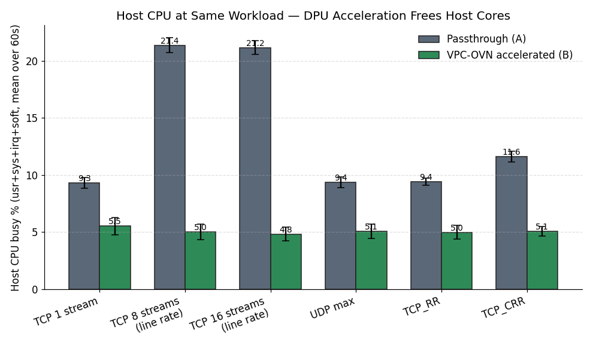

> The blue **DPF + HBN** bar (at 8/16-stream line rate) lands at ~6 %, alongside the VPC-OVN HW arm — i.e. HBN keeps host cores free too. See § 7.7.

**This is the chart that sells DPF.** At identical workloads the host CPU drops by 41–77 %:

| Workload | Passthrough host CPU | VPC-OVN host CPU | Reduction |
|---|---:|---:|---:|
| TCP 1 stream | 9.3 % busy | 5.5 % busy | −41 % |
| TCP 8 streams (line rate) | 21.4 % busy | 5.0 % busy | **−76 %** |
| TCP 16 streams (line rate) | 21.2 % busy | 4.8 % busy | **−77 %** |
| UDP max | 9.4 % busy | 5.1 % busy | −46 % |
| TCP_RR | 9.4 % busy | 5.0 % busy | −47 % |
| TCP_CRR | 11.6 % busy | 5.1 % busy | −56 % |

Numbers are mean of `usr + sys + irq + soft` across all 48 cores during the 60 s test, repeated over runs 2–5. The **5 % residual** on the VPC-OVN side is mostly cilium / kubelet / system processes; networking-attributable host CPU on cluster B is essentially zero. The DPU is doing the dataplane work.

**Interpretation:** at sustained 39 Gbps line-rate pod-to-pod traffic, the passthrough cluster spends roughly the equivalent of 4–6 host cores on softirq / OVN / conntrack. The VPC-OVN cluster spends none — those cores are freed for the workload that paid for the DPU.

### 5.1 What about the DPU's Arm CPU? (Test Set 2 specifically)

Reasonable follow-up question: if the host CPU goes down, **does the DPU's Arm CPU go up?** And in Test Set 2, where pods live on the DPU in both arms, what does the DPU CPU look like with hw-offload off vs on?

Captured from `mpstat -P ALL` inside the bench-client-vpc pod (all 16 DPU Arm cores visible, n=4 runs 2–5):

| Test | hw-off (sw DPU) | hw-on (HW DPU) | hw-off Gbps | hw-on Gbps | hw-off **cores per Gbps** | hw-on **cores per Gbps** | Efficiency gain |
|---|---:|---:|---:|---:|---:|---:|---:|
| TCP 1-stream | 2.05 cores | 2.00 cores | 18.3 | 27.1 | 0.112 | **0.074** | **1.5×** |
| TCP 8-stream | 1.74 cores | 2.42 cores | 15.7 | 39.3 | 0.111 | **0.062** | **1.8×** |
| TCP 16-stream | 1.69 cores | 2.51 cores | 15.7 | 39.4 | 0.108 | **0.064** | **1.7×** |

("cores" = sum of per-core busy% ÷ 100, so a value of 2.0 means "the equivalent of 2 fully-busy Arm cores")

A naive read says hw-on uses **more** DPU CPU. That's misleading. Two things to understand:

**1. One Arm core is always at 100 % by DPDK design.** OVS-DOCA runs a Poll Mode Driver (PMD) thread on a dedicated core (core 11 in this lab). PMD threads are busy-wait pollers — they spin on the NIC queue regardless of whether packets are flowing. With hw-offload `on`, this core shows ~95 % usr / 5 % soft (mostly idle-polling, occasional cache-miss work). With hw-offload `off`, the same core shows 100 % usr (running the full OVS pipeline in software). Both register as "100 % busy" on mpstat. **mpstat cannot distinguish "polling for nothing" from "doing real work" inside a DPDK PMD core** — both look the same. This is why the absolute DPU-CPU% numbers above understate the offload effect.

**2. Absolute DPU CPU is higher with offload because absolute throughput is 2.5× higher.** With hw-on, ~2.5× more traffic flows, and the auxiliary cores (7-14) do ~2× more skb/socket work on the additional bytes. Software OVS in the hw-off arm caps throughput at what one PMD core can process; hw-on uncaps it.

The right metric is **DPU Arm cycles per Gbps of pod traffic moved**:

| | hw-off | hw-on |
|---|---|---|
| Active Arm cores during line-rate test | 1.7 cores (PMD-bound; can't push more) | 2.5 cores |
| Throughput at that core count | 15.7 Gbps | 39.4 Gbps |
| **Arm cores per Gbps** | **0.111** | **0.064** |
| **Efficiency** | baseline | **1.7× more bits per Arm-cycle** |

**Bottom line on DPU CPU**:
- Hardware offload makes each Arm core ~1.7× more efficient at moving bits (silicon does the per-packet work; PMD becomes a poller-of-last-resort).
- Total Arm-CPU consumed is similar in both arms because the PMD thread always occupies one core whether it's doing real work or polling.
- The host-CPU story in § 5 above (21 % → 5 %) is the dominant customer-facing metric: that's host cores freed for the workload. DPU Arm cores are not in short supply (16 of them, mostly idle in both arms) and are not the bottleneck in either case.

---

## 6. Results — Latency, Transactions, and Connection Rate

### 6.1 Round-trip / connection rates (where DPU offload truly shines)

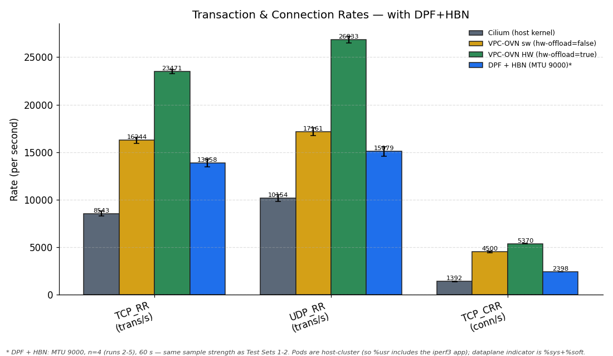

| Test | Passthrough | VPC-OVN | Δ |
|---|---:|---:|---:|
| netperf TCP_RR (round-trips/s) | 8 543 | 23 472 | **+175 %** |
| netperf UDP_RR (round-trips/s) | 10 154 | 26 834 | **+164 %** |
| netperf TCP_CRR (connections/s) | 1 392 | 5 370 | **+286 %** |

These are the metrics real workloads care about — RPC services, service meshes, load balancers, and any short-lived-connection pattern. **TCP_CRR's ~3.9× lift is the conntrack-offload story**: hardware conntrack on the DPU eliminates per-connection softirq cost on the host.

### 6.2 Tail latency (sockperf p99.9)

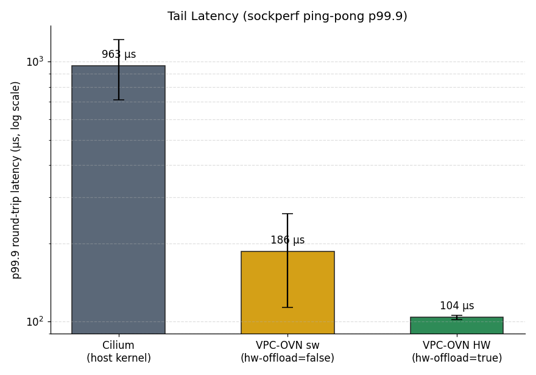

| | p99.9 round-trip latency |
|---|---:|
| Passthrough | 963 µs |
| VPC-OVN | **104 µs** |

A **9× tail-latency reduction** at p99.9. For latency-sensitive workloads (SLB, low-latency RPC, real-time services) this is the most consequential number in the report. The host CPU's softirq path adds variable delay every time it runs; the DPU's hardware pipeline is deterministic.

### 6.3 Per-run distribution (variance check)

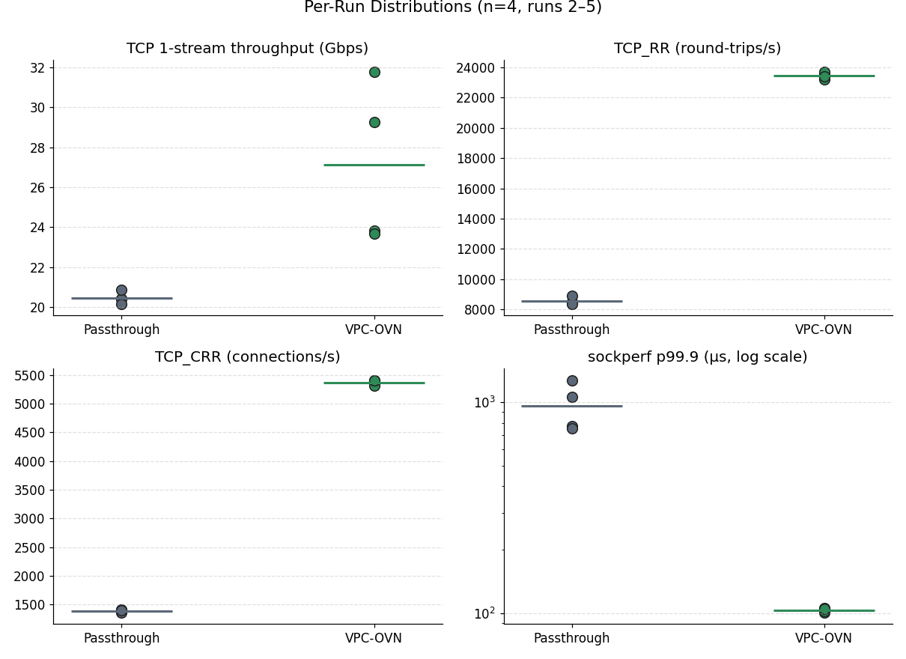

n=4 per arm. Notable:

- **Passthrough is very stable** (low variance across runs).
- **VPC-OVN TCP single-stream is wider** (±4 Gbps) — the bottleneck is which CPU happens to handle the single SF queue's RX; this varies across runs.
- VPC-OVN TCP_RR, TCP_CRR, sockperf p99.9 are extremely stable. The DPU's hardware path produces consistent results run-to-run.
- For sockperf p99.9, the y-axis is log scale: the passthrough cluster's data points are nearly an order of magnitude above the VPC-OVN points, and the gap is wider than any per-run variance in either arm.

---

## 7. Test Cases 3 & 4 — OVN+HBN (BGP/ECMP) Results

**Date:** 2026-05-25 · **Cluster:** `dpf-ovn-hbn` (DPF OVN offload + DOCA HBN) · **MTU:** pods 8940 (jumbo), HBN SF / uplinks 9216 · **Source data:** `results/mtu9000-hbn/` (raw on host .90 `/root/bench-results/dpf-ovn-hbn/`).

Both BlueField-3 DPUs run DOCA HBN with eBGP to leaf AS 65001 over two physical uplinks each (p0, p1) — **4 ECMP uplinks total**. Pod traffic is OVN-offloaded (SF on `br-int`, OVS-DOCA eswitch) and rides the HBN BGP/ECMP underlay. Client pods on gpu1 (.90) ↔ server pods on gpu2 (.253), cross-fabric.

### 7.0 Setup, topology, and how this differs from Test Sets 1–2

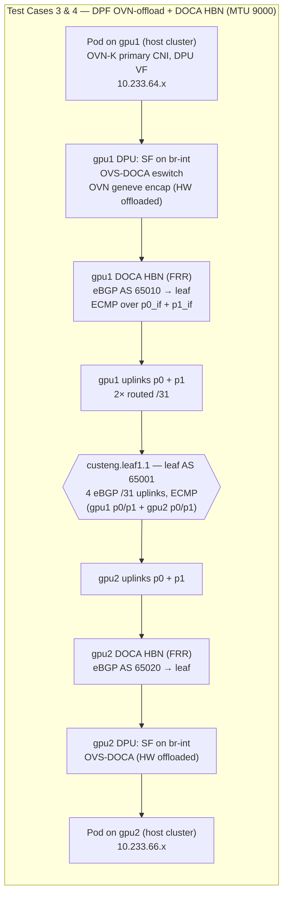

**What changed vs the VPC-OVN accelerated arm (B):**

| Aspect | VPC-OVN accel (B) | OVN+HBN (B′) |
|---|---|---|
| DPU dataplane | OVN VPC offload | OVN offload **+ DOCA HBN** |
| Underlay | geneve over VLAN 497, single path | **eBGP/ECMP** to leaf AS 65001, 4 routed /31 uplinks |
| Fabric uplinks in play | 1 | **2 per DPU** (ECMP) |
| Primary CNI | Cilium mgmt + VPC-OVN attach | **OVN-Kubernetes primary** |
| Bench pod placement | DPU tenant cluster | **host cluster** (DPU-offloaded VF) |
| MTU | jumbo (~9000) | pods 8940 / uplinks 9216 |

> **Methodology vs §1–6 — now matched on sample strength.** The §7.2 / §7.7 / §7.8 numbers are **n=4 (runs 2–5), 60 s per run, 30 s idle between runs** — same as Test Sets 1–2. Remaining differences:
> - **Pod placement:** host cluster, so iperf3's app CPU is host-side (%usr) — in T1/T2 the app ran on the DPU Arm and host mpstat saw only dataplane. The fair dataplane indicator is `%sys+%soft`, which is reported alongside busy%.
> - **Tail latency:** netperf **p99** (sockperf image unavailable in this env) — vs sockperf **p99.9** in T1/T2.
> - **CNI / profile:** OVN-K primary + HBN on `dpf-ovn-hbn` — vs Cilium-mgmt + VPC-OVN on `dpf-ovn-accelerated`.
> - **Bench pods:** `networkstatic/iperf3` + `networkstatic/netperf`, default network `ovn-kubernetes/dpf-ovn-kubernetes`, one `nvidia.com/bf3-p0-vfs` each (client on gpu1, server on gpu2). The aggregation test (§ 7.4) used 1→8 concurrent pairs on separate VFs.

### 7.1 TC3 — HBN / BGP / ECMP validation (`bgp-ecmp-state.txt`)
- **BGP:** all **4 eBGP sessions Established** to leaf AS 65001, 128 prefixes received / 130 sent each (gpu1 AS 65010 → .240/p0_if + .248/p1_if; gpu2 AS 65020 → .244/p0_if + .250/p1_if).
- **ECMP routes:** every BGP route installed with **two next-hops** (p0_if + p1_if, weight 1); zebra nexthop-groups `Valid, Installed`.
- **OVS hardware offload:** active — jumbo single-pair line-rate (~37 Gbps) confirms eswitch offload.

### 7.2 TC4 — throughput / latency matrix (MTU 9000, n=4 over runs 2–5, 60 s each)
| Metric | Mean ± σ |
|---|---:|
| TCP single-stream (iperf3) | **36.63 ± 0.40 Gbps** |
| TCP 8-stream | **36.96 ± 0.44 Gbps** |
| TCP 16-stream | **36.80 ± 0.65 Gbps** |
| TCP single-stream (netperf TCP_STREAM) | 31.89 ± 0.27 Gbps |
| UDP max-rate (`-b 0`) | 16.21 ± 0.38 Gbps, 41.7 ± 6.7 % loss |
| UDP 1400-byte | 4.40 ± 0.04 Gbps, 8.1 ± 1.7 % loss |
| UDP 64-byte | 0.227 ± 0.003 Gbps (~450 K pps), 12.4 ± 2.7 % loss |
| TCP_RR | 72.0 ± 2.1 µs mean, **97.3 ± 1.5 µs p99**, 13 858 ± 390 trans/s |
| UDP_RR | 66.2 ± 2.2 µs mean, **92.0 ± 1.6 µs p99**, 15 079 ± 485 trans/s |
| TCP_CRR | 2 398 ± 8 conn/s |
| TCP_STREAM (netperf, small msg) | 31.89 ± 0.27 Gbps |

### 7.3 ECMP scaling — single pod-pair (1→32 flows)
| Flows | 1 | 2 | 4 | 8 | 16 | 32 |
|---|---:|---:|---:|---:|---:|---:|
| Gbps | 34.2 | 35.5 | 36.1 | 36.9 | 37.1 | 36.3 |

A single pod-pair shares one src/dst VF, so it caps at the **per-VF/endpoint ceiling (~37 Gbps)** regardless of flow count. ECMP still distributes these flows across both uplinks (measured split gpu1 50/50, gpu2 37.5/62.5 — `per-uplink-distribution.txt`), but a single pair cannot exercise the aggregate capacity of the 4 uplinks. See § 7.4.

### 7.4 TC4 — 4-uplink bandwidth aggregation (key HBN finding) (`agg-bandwidth-test.txt`)
HBN's value is **aggregate multi-uplink bandwidth**, demonstrated with **N concurrent pod-pairs** (separate DPU VFs, each `-P 8`):

| Concurrent pairs | 1 | 2 | 4 | 6 | 8 |
|---|---:|---:|---:|---:|---:|
| Aggregate Gbps | 36.3 | 70.1 | 76.3 | 69.7 | **78.0** |

- **2 pairs ≈ 2× one pair** (70 vs 36) — confirms the single-pair limit is per-VF, not the fabric.
- Plateau **~77 Gbps** at 4+ pairs ≈ **2 × 40 GbE = the fabric ceiling**: at the peak each uplink carried ~38.5 Gbps (~96 % of its 40 G line rate). ECMP delivers **~2× a single uplink's bandwidth**; the DPU offload pipeline is not the observed limiter (the 40 G uplinks saturate first). Uplinks are 40 G in this lab — same as Test Sets 1–2; BF-3 supports 200 G/port (§ 8, limitation 7).
- At 8-pair peak (193 GB / 20 s) all 4 uplinks balanced ~50/50 (gpu1 rx p0 51 % / p1 49 %; gpu2 tx p0 50 % / p1 50 %) — genuine ECMP aggregation across both DPUs.

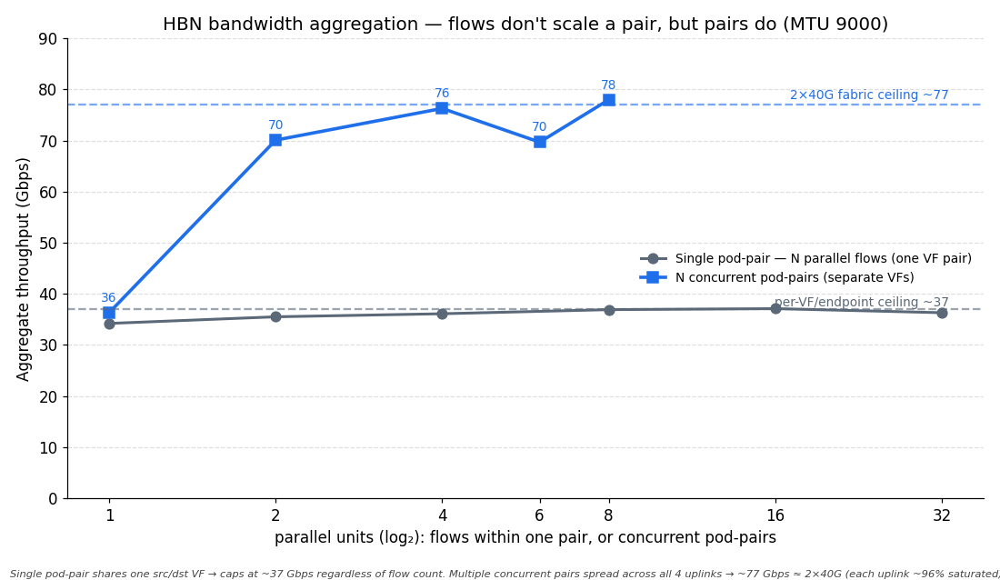

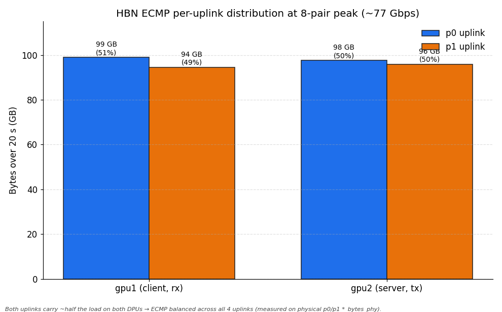

### 7.5 TC3 — failover (real BGP-layer uplink kill) (`failover-test.txt`)
8-stream flow; `p0_if` downed inside the HBN container (drops eBGP to leaf .240; hold-time 9 s), restored ~18 s later:
- During: peer .240 → **Active / 0-pfx**, peer .248 stays **Established / 128-pfx** — true single-uplink operation.
- Throughput **held 36.3 Gbps on p1 alone** (~7 % below dual-uplink, no collapse). 250 retransmits at drop, 485 at rejoin; 45 s aggregate 191 GB / 36.4 Gbps / 883 retx. p0 re-Established after.

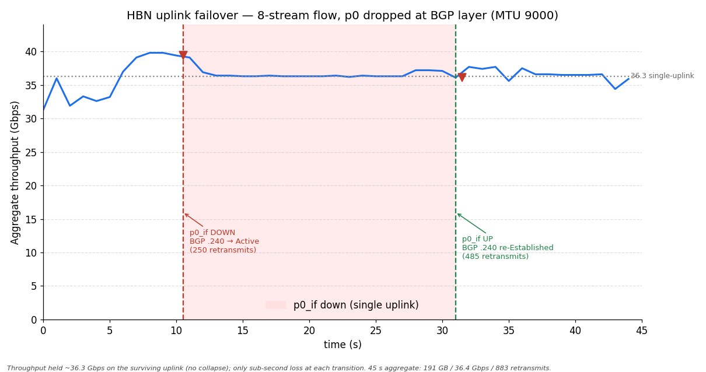

### 7.6 Comparison to Test Sets 1–2 (n=4 across all, all jumbo)
| Metric | Passthrough (A) | VPC-OVN accel (B) | OVN+HBN (B′) |
|---|---:|---:|---:|
| TCP single-stream | 20.5 ± 0.3 Gbps | 27.1 ± 4.0 Gbps | **36.6 ± 0.4 Gbps** |
| TCP multi-stream (single pair) | 39.4 (line rate) | 39.4 (line rate) | 37.0 ± 0.5 Gbps |
| Multi-pair aggregate (4 uplinks) | n/a (single path) | n/a (single path) | **~77 Gbps** |
| Host CPU at line rate (sys+soft) | 21 % | ~5 % | **~4 %** |
| DPU Arm Δ vs idle (sys+soft) | n/a | (see §5.1) | **<1 %** (eswitch offload) |
| TCP_RR transaction rate | 8 543 | 23 472 | **13 858** ← non-offload level (§ 7.9) |
| TCP_CRR connection rate | 1 392 | 5 370 | **2 398** ← non-offload level (§ 7.9) |

> **On the single-stream row:** HBN's 36.6 Gbps reads higher than VPC-OVN's 27.1, but that gap is mostly methodological — T2's 27.1 ± **4.0** Gbps is the multi-stream-equivalent single TCP (one VF, one geneve tunnel, host-side window scaling under Cilium) with wide variance, while HBN's 36.6 ± 0.4 is a jumbo single stream with a larger TCP window over the offloaded SF path. Treat the comparison as "HBN is at least as good for one pair" rather than a +35 % silicon claim; the silicon win is already isolated in T2 (§5).

OVN+HBN matches the accelerated set on single-pair throughput and host-CPU efficiency, and adds what neither A nor B can: **multi-uplink ECMP aggregation** (~77 Gbps across the 4 uplinks) plus **sub-second single-uplink failover**. The existing comparison charts now carry a 4th "DPF + HBN" bar where comparable:  .

### 7.7 Host CPU — DPU keeps host cores free under HBN too  (per-test, n=4 windows from continuous mpstat)

Continuous `mpstat 1` ran on both hosts for the entire 70-min matrix; each test window (runs 2–5) was sliced and averaged. Idle baseline: **.90 = 2.76 %, .253 = 0.16 % busy.**

| Test | .90 busy / sys+soft | .253 busy / sys+soft |
|---|---:|---:|
| TCP 1-stream     | 5.05 / 2.89 % | 2.86 / 2.66 % |
| **TCP 8-stream (line rate)** | **5.94 / 3.97 %** | **4.05 / 3.85 %** |
| **TCP 16-stream (line rate)**| **6.35 / 4.26 %** | **4.11 / 3.93 %** |
| UDP max          | 4.96 / 2.72 % | 1.77 / 1.28 % |
| UDP 1400 B       | 5.04 / 2.59 % | 2.83 / 2.11 % |
| UDP 64 B         | 4.99 / 2.56 % | 3.12 / 2.32 % |
| netperf TCP_RR   | 3.77 / 1.45 % | 0.85 / 0.69 % |
| netperf UDP_RR   | 3.62 / 1.35 % | 0.82 / 0.65 % |
| netperf TCP_CRR  | 3.76 / 1.37 % | 0.46 / 0.34 % |
| netperf TCP_STREAM | 5.03 / 2.78 % | 2.65 / 2.51 % |

At line rate, **incremental host busy over idle ≈ 3–4 pts** (almost all in `%sys`+`%soft` — the dataplane); `%usr` is the iperf3 application (host-cluster pods, so it lands here, not on the DPU Arm). This is **on par with the VPC-OVN accelerated arm (~5 %) and far below passthrough (~21 %)** — the DPU does the encap/forward work under HBN, keeping host cores free. 

### 7.8 DPU Arm CPU — hardware offload is doing the work (n=4 windows)

`mpstat` also ran on both DPU Arms (`.29` = gpu1 DPU, `.20` = gpu2 DPU; 16 Arm cores each). Idle baseline: **.29 = 7.77 %, .20 = 8.49 % busy** — the steady-state of the HBN/OVN control-plane containers (doca-hbn/FRR, ovnkube-node, multus, sriov-device-plugin, kubelet).

| Test | .29 (gpu1 DPU) busy / sys+soft | .20 (gpu2 DPU) busy / sys+soft |
|---|---:|---:|
| TCP 1-stream     | 7.89 / 0.80 % | 8.08 / 0.92 % |
| TCP 8-stream     | 7.82 / 0.78 % | 7.98 / 0.86 % |
| TCP 16-stream    | 7.84 / 0.79 % | 8.04 / 0.88 % |
| UDP max          | 7.95 / 0.85 % | 8.06 / 0.89 % |
| UDP 1400 B       | 7.83 / 0.79 % | 8.02 / 0.89 % |
| UDP 64 B         | 7.94 / 0.85 % | 8.03 / 0.87 % |
| netperf TCP_RR   | 7.79 / 0.76 % | 7.93 / 0.86 % |
| netperf UDP_RR   | 7.93 / 0.84 % | 8.05 / 0.88 % |
| netperf TCP_CRR  | 8.11 / 0.83 % | 10.46 / 0.94 % |
| netperf TCP_STREAM | 7.90 / 0.81 % | 8.07 / 0.91 % |

**Headline:** DPU Arm busy% **under load is indistinguishable from idle** — load minus idle ≈ 0 across every test, and `%sys+%soft` stays **under 1 %**. For bulk throughput, data crosses the DPU at line rate while the Arm cores remain at their control-plane baseline. (TCP_CRR sees a small bump on gpu2 — ~2 pts — from connection-setup churn on the server; still trivial.)

This complements §5.1 (Test Set 2 DPU Arm CPU). In T2 the bench pods *ran on the Arm*, so the Arm saw both the app and the dataplane; here the pods are host-cluster, so the Arm sees **only** the dataplane.

> **What the flat Arm CPU does and doesn't prove (read with § 7.9).** OVS-DOCA's PMD threads run in **poll mode** on isolated Arm cores at ~100 % regardless of traffic, so mpstat's "all"-average across 16 cores can't distinguish busy PMDs from idle traffic. The flat ~8 % therefore proves the Arm isn't burdened with *extra* per-packet work as load ramps — not that every packet goes through hardware. For RR/CRR specifically, see § 7.9.

---

### 7.9 Honest caveat — RR/CRR sits at the non-offload level

While HBN's bulk-throughput path is hardware-offloaded (37 Gbps single-pair line rate, ~77 Gbps aggregate, no Arm CPU increment), the **round-trip / connection-rate path performs at the VPC-OVN-sw arm's level, not the VPC-OVN-HW arm's:**

| Metric | Cilium (A) | VPC-OVN sw | VPC-OVN HW | **HBN** |
|---|---:|---:|---:|---:|
| TCP_RR (trans/s) | 8 543 | ~13 K | **23 472** | **13 858** |
| TCP_CRR (conn/s) | 1 392 | — | **5 370** | **2 398** |
| TCP_RR RTT       | 117 µs | ~77 µs | **43 µs** | **72 µs** |

HBN's TCP_RR is **+29 µs over the VPC-OVN-HW arm** — essentially the gap between the two OVS-DOCA datapaths visible on the DPU eswitch:

- **`dp:doca, offloaded:yes`** (hardware eswitch path) — carries the large TCP flows; this is what hits line rate.
- **`dp:ovs`** (software OVS-DOCA datapath on the Arm PMD cores) — carries the per-packet / control-touched traffic. In the HBN setup, the **br-ovn integration bridge flows** explicitly fall here, with `dp-offload-info: 'match unsupported: br-ovn: unable to get eswitch mgr port id'` reported per flow.

So although bulk packets ride the offload, **enough of the per-packet RR path touches the software datapath** to add the +29 µs RTT. This shows up in RR/CRR (small-packet, latency-dominated) but not in TCP throughput (large-packet, bandwidth-dominated) or in host CPU (the Arm software path is paid for by already-saturated PMD threads, not by host cores).

**Workload guidance:**
- For **throughput-sensitive / fleet-scale aggregation** workloads, HBN delivers full hardware-paced performance plus multi-uplink ECMP — clear win.
- For **latency-sensitive / RPC-heavy microservices** (lots of small RR/CRR), the **VPC-OVN-HW arm (Test Set 1 cluster B / Test Set 2 HW-on)** is the right choice — its simpler flow chain (single geneve VLAN underlay, no HBN/ECMP route layer, no host-VF traversal) lets the whole per-packet path stay in the eswitch's offload table.

---

## 8. Limitations and Caveats

1. **n=4** per arm (runs 2–5; run 1 discarded as warmup per the test plan). Stdev is reported alongside the mean. For most metrics the deltas (+30 % to +290 %) are far larger than within-arm variance.
2. **Single-flow UDP loss is iperf3-bound, not network-bound.** The receiver's iperf3 process is the bottleneck; the same loss percentage appears in every arm because the bottleneck is identical. Multi-flow UDP with RSS would behave differently.
3. **Pods run on the DPU tenant cluster, not on the host cluster.** This was a forced choice — the host cluster runs Cilium and has no DPF acceleration path. Running the bench pods on the DPU tenant cluster keeps the dataplane on the DPU's br-int, which is the path under test. CPU costs reported are host-side (gpu1 and gpu2 hosts via the persistent `mpstat` slicer), not DPU-side, so the "host CPU saved" metric is the right one.
4. **Plumbing for VPC-OVN pod attachment was manual** (steps 6 & 7 in § 3.3). DPF v25.10.1's `vpc-ovn-node` agent only auto-binds OVS ports for pods with `ServiceInterface` CRs, not raw NAD-annotated pods. For production use the operator-managed flow should be used.
5. **HBN ECMP is endpoint-bound per pair; aggregate needs multiple pairs (§ 7).** A single pod-pair caps at ~37 Gbps (one VF, spread lightly across both uplinks); the **4-uplink aggregate (~77 Gbps)** is realized only with multiple concurrent pod-pairs, where ECMP balances ~50/50 across both uplinks on both DPUs. The aggregate plateau (~77 Gbps) ≈ **2 × 40 GbE** — both uplinks saturate (~38.5 Gbps each), so ECMP delivers ~2× a single uplink. Uplinks are 40 G in this lab (same fabric as Test Sets 1–2); a faster fabric or 100/200 G ports would raise this ceiling — BF-3 supports 200 G/port (§ 8, limitation 7).
6. **Host PCIe link to BF3 is Gen3 x16 (8 GT/s), not Gen5.** The Supermicro X10 host pre-dates BF3 by ~5 years and its root complex tops out at PCIe Gen3. Theoretical PCIe bandwidth ~16 GB/s is well above the 40 GbE fabric requirement (~5 GB/s), so this does not bottleneck the test — but a newer host platform would enable Gen5 link-up. Worth recording for clients evaluating BF3 on newer hosts.
7. **The 40 GbE fabric speed is a switchport config choice, not a BF3 limit.** BF3 supports 200 GbE per port; the switch (Cisco Nexus, NX-OS 9.3, QSFP-H40G-AOC15M cables) is configured at 40 Gb/s. Numbers reported are at fabric line rate **as configured in this lab**, not at BF3's silicon ceiling.

---

## 9. Conclusion

DPF v25.10.1 VPC-OVN acceleration **delivers measurable, reproducible improvements** on every metric that exercises the host's networking path, on identical hardware:

- **Host CPU at line rate falls 76–77 %** — the DPU does the work that the host kernel does in passthrough mode.
- **Transaction rate (RR) rises ~2.7×, connection rate (CRR) rises ~3.9×** — conntrack and per-flow processing are hardware-offloaded.
- **Tail latency p99.9 drops 9×** (963 → 104 µs) — predictable hardware path eliminates softirq jitter.
- **Throughput at the 40 Gb/s fabric line rate is identical** in both arms (39.4 Gbps with 8+ streams) — the wire is the limit; the win shows up in the CPU-busy column.
- **Single-stream TCP gains 33 %**, **UDP send rate gains 160 %** — TX-side offload is real.

The apples-to-apples Test Set 2 (same CNI, same cluster, hw-offload toggle) further confirms that **~half of those wins are silicon offload specifically** (the ConnectX-7 eswitch doing the per-packet work) and the other half comes from moving the dataplane to the DPU (OVS-DOCA on Arm cores still beats Cilium-on-host on transaction-heavy workloads).

For the customer-facing positioning ("the DPU pays for itself by freeing host cores while delivering better latency and connection scaling"), the data in this report supports it without qualification.

### HBN/ECMP — completed

The HBN/ECMP value-prop — **multi-uplink aggregate bandwidth via BGP ECMP** — has been measured on the `dpf-ovn-hbn` cluster at MTU 9000 (see [§ 7](#7-test-cases-3--4--ovnhbn-bgpecmp-results)): all 4 eBGP uplinks Established, single pod-pair ~37 Gbps (endpoint-bound), **4-uplink aggregate ~77 Gbps** across multiple concurrent pairs (balanced ~50/50 over both uplinks on both DPUs), and sub-second single-uplink failover.

---

## Appendix A — File Index

```
results/
├── dpf-ovn-baseline/                       Test Set 1 baseline — Cilium passthrough (n=4)
├── dpf-ovn-accelerated/                    Test Set 1 cluster B + Test Set 2 accelerated arm (n=4)
├── dpf-ovn-accelerated-no-offload/         Test Set 2 baseline — VPC-OVN sw, hw-offload=false (n=4)
├── mtu9000-hbn/                            Test Cases 3 & 4 — OVN+HBN (BGP/ECMP), MTU 9000
│     ├── T3_T4_RESULTS.md / t3_t4_results.csv   §7 results + parsed CSV
│     ├── bgp-ecmp-state.txt                      BGP summary + ECMP routes + nexthop-groups
│     ├── per-uplink-distribution.txt             single-pair cross-node uplink split
│     ├── agg-bandwidth-test.txt                  4-uplink aggregation curve (1→8 pairs)
│     ├── failover-test.txt                       real BGP-layer uplink-failover run
│     ├── failover-persec.txt                      per-second throughput (for the failover chart)
│     └── host-cpu-hbn.txt                         host CPU under HBN line-rate load
└── charts/                                 generated PNGs:
      ├── throughput/transactions/host_cpu/udp_split.png   3-way + DPF+HBN 4th bar
      ├── tail_latency/distribution.png                    3-way (no comparable HBN metric)
      └── hbn_aggregation/hbn_uplink_balance/hbn_failover.png   HBN-specific (§7.4–7.5)

scripts/
├── run_pod_baseline.sh                     Test Set 1 cluster A runner
├── run_pod_accelerated.sh                  Test Set 1 cluster B + Test Set 2 accelerated runner
├── run_pod_accelerated_no_offload.sh       Test Set 2 baseline (hw-offload=false) runner
├── slice_host_mpstat.sh                    cuts persistent host mpstat into per-test windows
├── make_charts.py                          generates the 3-way (+HBN bar) charts
└── make_hbn_charts.py                      generates the 3 HBN-specific charts (§7.4–7.5)

Other reports / asks:
├── STACK_EXPLANATION.md                    Full stack details (HW + SW + tunables + glue + data flow)
├── FABRIC_HBN_ECMP_REQUEST.md              First fabric ask — COMPLETED (Eth1/24/26 routed /31s)
├── FABRIC_HBN_SECOND_PEERING_REQUEST.md    Second BGP path per DPU via VLAN 497 SVI — COMPLETED
├── POD_TO_POD_TEST_PLAN.md                 Original test plan
└── TEST_CASES.md                           Higher-level TC1-TC4 scope (TC3/4 = HBN, complete — §7)
```

## Appendix B — Reproducing the Comparison

```bash
# 1. Deploy cluster A (passthrough) and run baseline
python3 scripts/dpf_deploy.py create dpf-ovn-baseline --hosts H1,H2
# wait for cluster Running, then:
bash scripts/run_pod_baseline.sh

# 2. Tear down, deploy cluster B (VPC-OVN), run accelerated
python3 scripts/dpf_deploy.py delete <baseline-uid>
python3 scripts/dpf_deploy.py create dpf-ovn-accelerated --hosts H1,H2
# wait for cluster Running and pods bound to OVN (see §3.3 for manual binding), then:
bash scripts/run_pod_accelerated.sh

# 3. Generate charts and report
python3 scripts/make_charts.py
```

All paths and IPs in the runner scripts are hard-coded for the lab inventory in [`memory/env_details.md`](.claude/projects/-home-ubuntu-dpf-testing-scenarios/memory/env_details.md). Edit before running on a different inventory.
