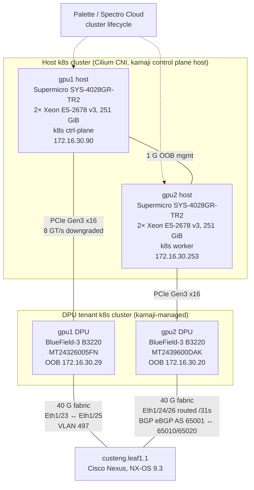
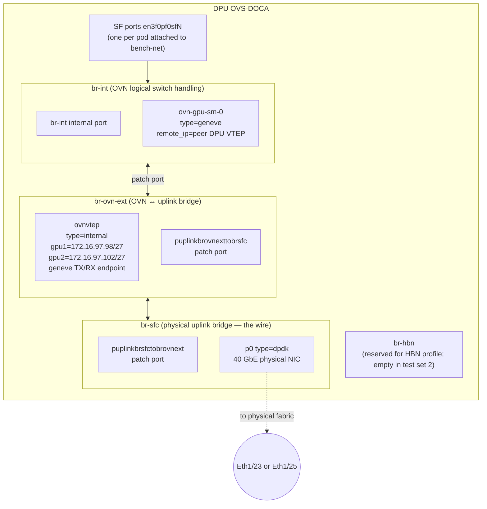
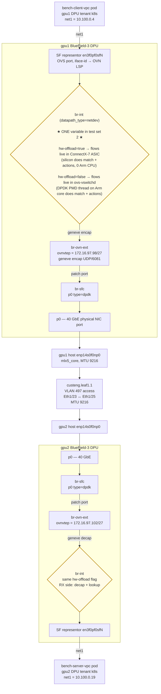
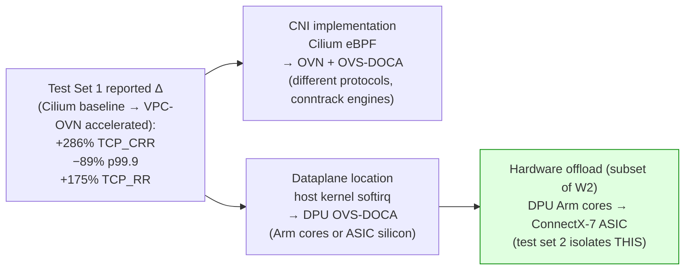
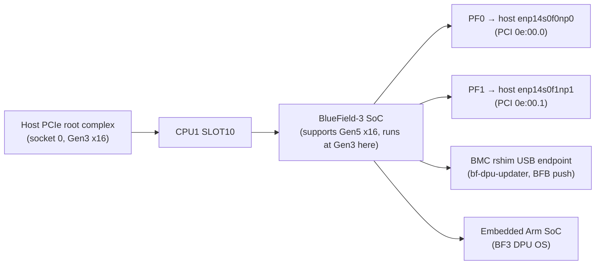
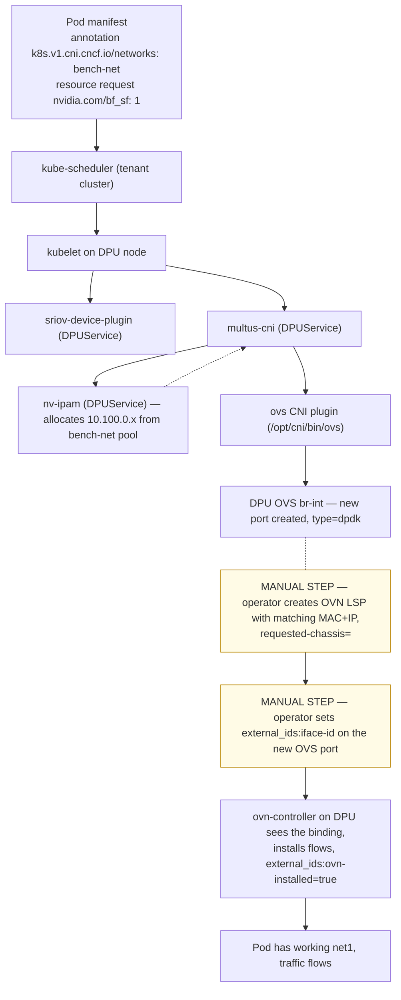

# DPF Test Stack — Hardware, Software, Data Flow, and Tuning

**Companion to:** [BENCHMARK_REPORT.md](BENCHMARK_REPORT.md). This document explains *what* was tested. The benchmark report explains *how it performed*.

---

## 0. Comparison framework

There are two A/B comparisons in this study. The second one is what the client asked for after the demo.

### Test Set 1 — original ("full-stack" comparison)

| | Cluster A — `dpf-ovn-baseline` (Passthrough + Cilium) | Cluster B — `dpf-ovn-accelerated` (VPC-OVN) |
|---|---|---|
| Primary pod CNI | **Cilium** (eBPF, native routing) | **Flannel** primary + **VPC-OVN** as secondary (Multus) |
| Pod IP range used | `100.64.0.0/16` (Cilium-managed) | `10.100.0.0/24` (VPC-OVN, allocated by nv-ipam) |
| Pod-to-pod wire | **40 G fabric** — pod traffic egresses host enp14s0f0np0, traverses the DPU's `br-sfc` (passthrough chain `p0 ↔ pf0hpf`), out to the leaf via Eth1/23/25 VLAN 497 | **40 G fabric** — pod traffic enters the DPU's `br-int` via SF, geneve-encapped through `br-ovn-ext`/`br-sfc`, out to the leaf via VLAN 497 |
| Dataplane location | **host kernel eBPF** (encap/decap, conntrack, routing) | **DPU OVS-DOCA** (HW-offloaded when test set 2's hw-offload=true) |
| What it measures | "Out-of-the-box default DPF deployment vs. out-of-the-box default Cilium deployment" — combined effect of CNI implementation + dataplane location |

Both arms hit the 40 G fabric. The wire is **not** a variable. What conflates the delta is:
1. **CNI implementation** — Cilium eBPF (with native routing) vs OVS-DOCA + OVN logical switch + geneve
2. **Dataplane location** — host kernel softirq (Cilium) vs DPU Arm cores or ASIC (OVS-DOCA)

The original test plan ([`POD_TO_POD_TEST_PLAN.md`](POD_TO_POD_TEST_PLAN.md) § "Required cluster posture") flagged that the CNI choice itself confounds the comparison:

> "The current cluster uses cilium. Cilium does not have a DPF/BlueField acceleration path in DPF v25.10.1."

Test Set 1's headline numbers are valid as "what does the customer see when they deploy default DPF vs default Cilium on identical hardware." But the delta blends "CNI implementation" with "where the dataplane runs." Test Set 2 isolates the second variable cleanly.

### Test Set 2 — apples-to-apples, single variable (this rerun)

The client asked for a same-CNI rerun. The cleanest single-variable A/B keeps **everything** identical except one flag on the DPU's OVS:

| | New baseline — `vpc-ovn-no-offload` | Accelerated — `vpc-ovn-hw-offload` (the existing data) |
|---|---|---|
| Cluster | **same** `dpf-ovn-accelerated` cluster | same |
| Pod CNI | **same** VPC-OVN (Multus secondary) | same |
| Pod IPs / NAD / OVN logical switch | **same** | same |
| Wire | **same** 40 G fabric, VLAN 497 | same |
| DPU OVS bridges + tunnels | **same** br-int → br-ovn-ext → br-sfc → p0 → geneve | same |
| **OVS `other_config:hw-offload`** | **`false`** — flows handled by ovs-vswitchd software path on DPU Arm cores | **`true`** — flows installed in ConnectX-7 hardware tables |

The **only** thing that changes between A and B in test set 2 is whether OVS-DOCA installs flow rules into the ConnectX-7 ASIC or processes them in the DPU's userspace vswitchd. Every other variable is fixed. That's what makes the delta cleanly attributable to **hardware offload**.

#### What each run answers

| Question | Comes from |
|---|---|
| "What does a *default* DPF deployment buy me vs a *default* Cilium deployment on the same hardware?" | Test Set 1 (in [BENCHMARK_REPORT.md](BENCHMARK_REPORT.md)) |
| "Of that total win, how much is specifically the silicon-level flow offload?" | Test Set 2 (this rerun — results pending) |
| "How much is the CNI choice (OVS vs Cilium eBPF)?" | Test Set 1 ↔ Test Set 2 baseline subtraction |

> **Important:** test set 2's baseline (hw-offload=false) is *not* "OVN on host CPU." It is "OVN on the DPU's Arm cores doing software vswitchd with DPDK PMD threads." The dataplane still runs on the DPU; what changes is whether the silicon does the per-packet work or the Arm SoC does it. For "OVN on host CPU vs OVN on DPU," see [§ 9](#9-future-rerun--ovn-kubernetes-on-host-baseline).

### Results matrix — final, all three datasets complete (n=4)

All numbers are mean ± stdev over runs 2–5 (n=4, run 1 discarded as warmup). Raw data is on disk at the paths shown in [§ 11. File index](#11-file-index).

| Metric | **Test Set 1 baseline**<br/>Passthrough + Cilium<br/>`results/dpf-ovn-baseline/` | **Test Set 2 baseline**<br/>VPC-OVN, hw-offload=false<br/>`results/dpf-ovn-accelerated-no-offload/` | **Test Set 1 B = Test Set 2 accel**<br/>VPC-OVN, hw-offload=true<br/>`results/dpf-ovn-accelerated/` |
|---|---:|---:|---:|
| TCP 1-stream (Gbps) | 20.47 ± 0.30 | 18.29 ± 2.87 | **27.14 ± 4.03** |
| TCP 8-stream (Gbps) | 39.40 ± 0.08 (line) | 15.68 ± 2.08 | **39.35 ± 0.01** (line) |
| TCP 16-stream (Gbps) | 39.43 ± 0.02 (line) | 15.71 ± 1.56 | **39.35 ± 0.01** (line) |
| UDP max sender (Gbps) | 9.19 ± 0.12, loss ~60 % | 22.57 ± 0.54 | **23.92 ± 0.13**, loss 54 % |
| UDP 1400 B sender (Gbps) | 1.78 ± 0.02 | 4.97 ± 0.43 | 4.83 ± 0.05 |
| netperf TCP_RR (trans/s) | 8 543 ± 244 | 16 244 ± 341 | **23 472 ± 221** |
| netperf UDP_RR (trans/s) | 10 154 ± 333 | 17 161 ± 406 | **26 834 ± 339** |
| netperf TCP_CRR (conn/s) | 1 392 ± 20 | 4 500 ± 106 | **5 370 ± 47** |
| netperf TCP_STREAM 1 B (Mbps) | 7.9 ± 0.2 | 11.5 ± 0.1 | 11.2 ± 0.6 |
| **sockperf p99.9 (µs)** — lower is better | 963.0 ± 250.3 | 186.4 ± 73.3 | **103.7 ± 2.2** |

| Host CPU (gpu1 client, % busy) | Cilium | VPC-OVN sw | VPC-OVN HW |
|---|---:|---:|---:|
| TCP 8-stream (at line rate) | 21.4 ± 0.6 % | 9.8 ± 1.4 % | **5.0 ± 0.7 %** |
| TCP 16-stream (at line rate) | 21.2 ± 0.6 % | 10.2 ± 0.8 % | **4.8 ± 0.6 %** |
| TCP_RR | 9.4 ± 0.3 % | 10.3 ± 1.1 % | **5.0 ± 0.6 %** |
| TCP_CRR | 11.6 ± 0.5 % | 9.9 ± 1.0 % | **5.1 ± 0.4 %** |

#### Two clean A/B comparisons fall out

**Test Set 1: Cilium-on-host  →  VPC-OVN-on-DPU (HW offload on)** — the full-stack "default DPF vs default Cilium" delta (column 1 → column 3):

- TCP single-stream **+32.6 %**, multi-stream same line rate
- UDP max sender **+160 %**
- TCP_RR **+175 %**, UDP_RR **+164 %**, TCP_CRR **+286 %**
- sockperf p99.9 **−89 %** (9× lower tail latency)
- Host CPU at line rate **−77 %** (21 % → 5 %)

**Test Set 2: VPC-OVN-on-DPU-software  →  VPC-OVN-on-DPU-HW-offload** — isolates the silicon-offload contribution (column 2 → column 3):

- TCP single-stream **+48 %** (18.3 → 27.1 Gbps)
- TCP multi-stream **+150 %** (15.7 → 39.4 Gbps line rate — software PMD core saturates without offload)
- UDP max sender **+6 %** (sender saturates elsewhere)
- TCP_RR **+44.5 %**, UDP_RR **+56.4 %**, TCP_CRR **+19.3 %**
- sockperf p99.9 **−44 %** (186 → 104 µs)
- Host CPU at line rate **halved again** (10 % → 5 %)

#### How the deltas decompose

The Test Set 1 wins decompose roughly as:

| Effect | Approximate share of Test Set 1's delta |
|---|---|
| Moving from Cilium-eBPF-on-host to OVS-DOCA-on-DPU (W1+W2 minus W3) | column 1 → column 2 |
| Hardware offload to ConnectX-7 ASIC (W3 alone) | column 2 → column 3 |

So a customer's actual benefit comes from **both** moving the dataplane to the DPU **and** the silicon offload, in roughly equal magnitudes for transaction-rate workloads, and dominated by silicon offload for line-rate-bound multi-stream throughput.

---

## 1. Hardware inventory

### 1.1 Servers (gpu1, gpu2 — identical configuration)

| Layer | Detail |
|---|---|
| **Chassis** | Supermicro **SYS-4028GR-TR2** (X10 generation, 4U GPU server) |
| **Motherboard** | Supermicro **X10DRG-O+-CPU** rev 1.00 |
| **BIOS** | AMI v3.2, release 2019-12-13 (pre-dates BlueField-3 — not a recent platform) |
| **Host BMC** | Supermicro IPMI, firmware 3.86 (Product ID 0x0892), ASPEED Graphics Family BMC controller |
| **Power supplies** | 2× Supermicro **PWS-2K05A-1R** (redundant 1+1), 2000 W max each, status OK on both |
| **Sockets** | 2 |
| **CPU per socket** | Intel **Xeon E5-2678 v3** (Haswell-EP, launched 2014) — 12 cores / 24 threads, base 2.5 GHz, max turbo 3.6 GHz, 30 MB L3, microcode 0x43, SMT/hyperthreads enabled |
| **Total threads** | **48** (2 sockets × 12 cores × 2 SMT) |
| **NUMA** | 2 nodes — Node 0: CPUs 0-11,24-35; Node 1: CPUs 12-23,36-47 |
| **Memory** | **251 GiB DDR4-2133 ECC RDIMM** — **8 of 24 DIMM slots populated** with 32 GB Samsung M386A4G40DM0-CPB modules (= 256 GB raw, 251 GB usable). Both sockets populated; channel layout not fully balanced (room for growth). |
| **GPUs (installed but unused for this test)** | 2× **NVIDIA Quadro RTX 6000/8000** (TU102GL, Turing, PCI 07:00.0 and 0f:00.0) — present in the host but not exercised by the network benchmarks. These are GPU compute servers; the network workload here doesn't touch them. |
| **Storage** | OS root: 465 GB Samsung SSD 870 (SATA); data: 2× 1.8 TB SanDisk SDSSDH3 (SATA) |
| **OS-mgmt NIC (1 G OOB)** | Intel I350 dual-port (`enp129s0f0/f1`) — IP `172.16.30.90` (gpu1) / `172.16.30.253` (gpu2) on f0; f1 unused |
| **Secondary mgmt NIC (10 G)** | Intel **X540-AT2** dual-port copper 10 GbE (`ens1f0/f1`, PCI 01:00.0/0.1, driver ixgbe, FW 0x800005a6 / 1.2960.0) — `ens1f0` is up at 10 Gb/s; used for upstream lab connectivity / image registries / Palette. Not on the test data path. |
| **Data NIC (40 G fabric)** | NVIDIA **BlueField-3 integrated ConnectX-7** — exposed to host at PCI `0e:00.0/0.1` as `enp14s0f0np0` / `enp14s0f1np1`, MTU 9216, driver mlx5_core v25.10-1.7.1, NIC FW 32.47.1088. The MAC range `c4:70:bd:2b:f6:9X` (gpu1) / `c4:70:bd:f0:65:cX` (gpu2). |
| **PCIe slot used for BF3** | **CPU1 SLOT10** (per Supermicro DMI), connected to socket 0's PCIe root complex |
| **PCIe link host ↔ BF3** | x16, **Speed 8 GT/s (Gen3, downgraded from BF3's native 32 GT/s Gen5)** — host PCIe root is Gen3 only; BF3 supports Gen5. Theoretical bandwidth ~16 GB/s (Gen3 x16), well above the 40 GbE fabric's 5 GB/s requirement, so not a bottleneck for this test — but a configuration detail worth recording. |

### 1.2 BlueField-3 DPUs

| Layer | Detail |
|---|---|
| **Model** | NVIDIA BlueField-3 **B3220 P-Series FHHL DPU** (part `900-9D3B6-00CV-A_Ax`) |
| **PSID** | `MT_0000000884` |
| **Integrated NIC** | ConnectX-7 — 200 GbE per port max, NDR200 IB max, dual-port QSFP112, crypto-enabled |
| **Per-port speed (this lab)** | 40 GbE (limited by switchport config, not the silicon) |
| **DPU SoC** | 16× Arm **Cortex-A78AE**, single-socket, aarch64 |
| **DPU on-board RAM** | 32 GiB DDR (ECC) |
| **DPU on-board storage** | 38.9 GB eMMC (OS root); 119.2 GB Toshiba KBG40ZPZ128G NVMe (M.2, used for container images and DPUService state) |
| **BlueField FW** | 32.47.1088 |
| **UEFI** | 14.40.0010 |
| **PXE FW** | 3.8.0201 |
| **UEFI virtio-blk / virtio-net FW** | 22.4.0014 / 21.4.0013 |
| **Integrated BMC** | OpenBMC `BF-25.10-15` (build 2025-12-09), accessible at `172.16.30.36` (gpu1) and `172.16.30.33` (gpu2) — root/Welcome2spectr0! |
| **Base MAC** | gpu1: `c4:70:bd:2b:f6:92` / gpu2: `c4:70:bd:f0:65:c6` |
| **Serial numbers** | gpu1: `MT24326005FN`; gpu2: `MT2439600DAK` |

#### DPU firmware mlxconfig (key settings, both DPUs)

```
INTERNAL_CPU_MODEL              = EMBEDDED_CPU(1)
INTERNAL_CPU_RSHIM              = ENABLED(0)
INTERNAL_CPU_OFFLOAD_ENGINE     = ENABLED
SRIOV_EN                        = True(1)
NUM_OF_VFS                      = 46
PER_PF_NUM_SF                   = True(1)
PF_TOTAL_SF                     = 20  (per profile, set by DPF on first install)
PF_BAR2_ENABLE                  = False(0)
LINK_TYPE_P1, LINK_TYPE_P2      = ETH
LAG_RESOURCE_ALLOCATION         = (HBN profile sets =1; current VPC-OVN flavor leaves default)
```

These settings are baked in by the **DPUFlavor** that DPF applies during BFB install (see § 3.2).

### 1.3 Fabric switch

| Component | Specification |
|---|---|
| Hostname | `custeng.leaf1.1` |
| Platform | Cisco Nexus, NX-OS 9.3(11) Bios v07.69 |
| DPU-facing ports | Eth1/23 ↔ gpu1.p0 (VLAN 497), Eth1/24 ↔ gpu1.p1 (routed /31 since 2026-05-13), Eth1/25 ↔ gpu2.p0 (VLAN 497), Eth1/26 ↔ gpu2.p1 (routed /31) |
| Fabric VLAN | 497 (`dpf-dummy-fabric`, untagged) — subnet `172.16.97.0/24`, MTU 9216 |
| HBN /31s | `Eth1/24 ↔ 172.16.97.248/31`, `Eth1/26 ↔ 172.16.97.250/31` — eBGP AS 65001 (leaf) ↔ AS 65010 (gpu1) / AS 65020 (gpu2); leaf router-id `11.0.0.111` |
| Cable type | QSFP-H40G-AOC15M |
| Per-port speed | 40 Gb/s full-duplex, MTU 9216, autoneg off |

---

## 2. Cluster topology (both A and B)



- **Host k8s cluster** (managed by Palette) runs the DPF operator and the kamaji tenant control plane.
- **DPU "tenant" k8s cluster** is the per-DPU kubelet that DPF brings up in zero-trust mode. Both DPUs are nodes in this tenant cluster.
- Bench pods in test set 2 (and test set 1 cluster B) run on the **DPU tenant cluster** (one pod per DPU node).
- Bench pods in test set 1 cluster A ran on the **host k8s cluster** (one pod per host node).

This split was a forced choice: the host k8s cluster uses Cilium and has no DPF acceleration path, so to exercise the DPU dataplane the bench pods had to be on the DPU tenant cluster.

---

## 3. Software stack

### 3.1 Host (gpu1, gpu2)

| Layer | Version / Detail |
|---|---|
| OS | Ubuntu 24.04.4 LTS (Noble Numbat) |
| Kernel | 6.8.0-94-generic — Ubuntu HWE kernel, x86_64 |
| CPU microcode | 0x43 (Intel Haswell-EP) |
| Kernel cmdline (full) | `BOOT_IMAGE=/boot/vmlinuz-6.8.0-94-generic root=/dev/mapper/vgroot-lvroot ro intel_iommu=on iommu=pt pci=realloc` |
| `intel_iommu=on iommu=pt` | enables IOMMU passthrough mode (required for SR-IOV / VFIO that DPF VPC-OVN uses) |
| `pci=realloc` | allows kernel to renumber BARs at boot (needed for some BF3 PCIe configurations) |
| Loaded mlx5 / RDMA modules | `mlx5_ib` (552 KiB), `mlx5_core` (loaded via DKMS), `ib_core`, `ib_uverbs`, `ib_cm`, `ib_ipoib`, `ib_umad`, `rdma_cm`, `rdma_ucm`, `iw_cm` — all from NVIDIA OFED/DOCA |
| Other relevant modules | `vfio_pci`, `vfio_pci_core`, `vfio_iommu_type1`, `iommufd` (used by VPC-OVN SF allocation); `vxlan` + `udp_tunnel` + `ip6_udp_tunnel` (for Cilium); `nf_conntrack`, `nf_nat` (host k8s) |
| NVIDIA OFED / DOCA package | OFED-internal 25.10-1.7.1; `doca-ofed` meta-package 3.2.1-044000 |
| MFT (firmware tools) | 4.34.1-10 (`mft`, `mft-mlx5`, `mft-nvredfish`, `kernel-mft-dkms`); `knem-dkms` 1.1.4.90mlnx4 |
| DKMS: `mlnx-ofed-kernel-dkms` | 25.10.OFED.25.10.1.7.1.1-1 |
| Container runtime | containerd 1.7.x (Spectro Palette build, sock at `/run/spectro/containerd/containerd.sock`, runc-v2 shim) |
| Kubernetes | v1.33.6 — host control plane; kamaji tenant control plane runs as deployment in host cluster |
| Cilium (host CNI) | v1.18.4, image `us-docker.pkg.dev/palette-images/packs/cilium/1.18.4/cilium:v1.18.4` — eBPF dataplane, native routing |
| Multus | DPF chart v0.1.0 — secondary-network meta-plugin (host cluster + tenant cluster both) |
| DPF operator | v25.10.1 (`nvcr.io/nvidia/doca/dpf-system:v25.10.1`); plus dpf-provisioning-controller-manager and dpf-operator-controller-manager |
| Spectro Palette | edge agent (Stylus), manages cluster lifecycle, edge-native BYOI mode |

### 3.2 DPU (both BlueField-3s)

| Layer | Version / Detail |
|---|---|
| OS | Ubuntu 24.04.3 LTS for BlueField — DOCA-flavored |
| Kernel | 6.8.0-1013-bluefield-64k — BlueField-tuned kernel, **64 KB page size** (vs 4 KB on host), aarch64 |
| Kernel cmdline (full) | `BOOT_IMAGE=/boot/vmlinuz-6.8.0-1013-bluefield-64k root=UUID=... ro console=hvc0 console=ttyAMA0 earlycon=pl011,0x13010000 fixrtc net.ifnames=0 biosdevname=0 iommu.passthrough=1` |
| `iommu.passthrough=1` | DPU runs IOMMU in passthrough mode — keeps DMA addresses 1:1, avoids translation overhead |
| `net.ifnames=0 biosdevname=0` | preserve traditional NIC names (p0/p1 instead of enp-style) |
| Loaded modules | `openvswitch` (393 KiB), `mlx5_ib`, `nsh`, `nf_conntrack`, `nf_nat`, `macsec`, `mlx5_fwctl`, full RDMA stack (`ib_core`, `rdma_cm`, etc.) |
| DOCA software | DOCA 3.2.1025-1 — `doca-bench`, `doca-caps`, `doca-comm-channel-admin`, `doca-dms`, `doca-devel`, `doca-apsh-config`, etc. |
| DOCA libraries | `/opt/mellanox/doca/{include,lib,applications}/` |
| OVS-DOCA | 3.2.1005, DB schema 8.5.1 — installed as part of the BFB |
| FRR (we installed during HBN setup) | FRRouting 8.4.4 — BGP daemon for HBN underlay testing |
| Container runtime | containerd 1.7.28 (CRI v1, sock at `/run/containerd/containerd.sock`) |
| Kubernetes (kamaji tenant) | v1.33.6 — DPU is a node in this tenant cluster |
| Flannel (default CNI, tenant cluster) | v1, VXLAN backend, default-pod-network on 10.244.x.x |
| DPUService chain (cluster B, all `Phase=Success`) | `cni-installer`, `flannel`, `multus`, `nvidia-k8s-ipam`, `ovn-central`, `ovn-controller`, `ovs-cni`, `sfc-controller`, `sriov-device-plugin`, `vpc-ovn-controller`, `vpc-ovn-node` |
| DPUDeployment | `vpc-ovn` (cluster B only), wraps the above DPUServices |
| BFB | `bf-bundle-3.2.1-34_25.11_ubuntu-24.04_64k_prod.bfb` (referenced by URL `https://content.mellanox.com/BlueField/BFBs/Ubuntu24.04/...`) |
| Cloud-init bf.cfg | Generated per-DPU by DPF; includes BMC user setup, mlxconfig nvconfig, kubeadm-join script, netplan, firmware-update hooks |
| rshim (host-side) | Package `rshim 2.5.7` available but service `inactive`/disabled — BF3 in ZT mode uses BMC-side rshim only |

### 3.3 OVS-DOCA configuration on each DPU (cluster B / both test set 2 arms)

```
other_config = {
  doca-init         = "true"     # use OVS-DOCA, not vanilla OVS-DPDK
  hw-offload        = "true"     ★ the ONE variable in test set 2
                                   "true"  → flows installed in ConnectX-7 ASIC (accelerated)
                                   "false" → flows handled by DPU userspace vswitchd (baseline)
  dpdk-max-memzones = "50000"
  pmd-quiet-idle    = "true"
  max-idle          = "20000"
  max-revalidator   = "5000"
}
```

`hw-offload` is changed via `ovs-vsctl set Open_vSwitch . other_config:hw-offload=<true|false>` followed by `systemctl restart ovs-vswitchd`. Takes ~5 seconds; no pod, no NAD, no OVN config changes — and the `ovnvtep` interface stays up across the restart.

OVS bridges on each DPU (all `datapath_type: netdev`):



### 3.4 Cluster profiles (Palette UIDs)

| Profile | UID | Role |
|---|---|---|
| `DPF ZT CP-Agent NetOp v2` | `69f25bfa957ca8a8c6eeb06a` | Infra: k8s + DPF operator + 6 custom hardening manifests |
| `Spectro-DPU-DPF-CP-Configs` | `69b7039ae8451ebc583d6a13` | DPF CP-side configs |
| `DPF Zero Trust Use Case — Passthrough` | `69834c1973ed315efeaed916` | (Cluster A) DPU is wire; OVS chain `p0 ↔ pf0hpf` only |
| `DPF Zero Trust Use Case — VPC-OVN Accelerated v2` | `69fb7b33c4934d2627f3a67c` | (Cluster B) Full VPC-OVN DPUDeployment + DPUServices |
| `DPF Zero Trust Use Case — DOCA HBN` | `698dd2dd4b0c719b6c763605` | (Pending — TC3/TC4) HBN flavor + BGP unnumbered + EVPN |

---

## 4. Data flow

### 4.1 Test Set 2 — single pipeline, one variable (the apples-to-apples comparison)

In test set 2 both arms use the exact same end-to-end pipeline. The difference is **how** OVS-DOCA processes a packet once it arrives at `br-int`.



Everything except the highlighted `br-int` block (yellow) is identical in both arms. Same wires, same pods, same OVN logical switch, same SFs, same geneve tunnels.

### 4.2 What "hardware offload" actually does inside the BlueField-3

OVS-DOCA hardware offload is **not** a magic acceleration knob — it's a specific mechanism inside the ConnectX-7 ASIC on the DPU. Brief mechanics:

| Layer | Without offload (test set 2 baseline) | With offload (test set 2 accelerated) |
|---|---|---|
| First packet of a flow | DPDK PMD thread on Arm core processes it, runs the OpenFlow pipeline, computes the action set | Same — first packet always punts to software |
| Subsequent packets | Each packet goes through ovs-vswitchd, full software pipeline, ~1 Arm core per ~1 Mpps | Software writes the flow's action set into the **eswitch flow table** in ConnectX-7 (a TCAM-like hardware table). All subsequent packets are forwarded entirely in silicon, ~0 Arm CPU |
| Connection tracking | Software conntrack table in vswitchd | Hardware conntrack module in ConnectX-7 (offloaded for established flows) |
| Encap / decap | Software (DPDK lib) constructs geneve headers | Hardware geneve TX/RX engine in the NIC |
| Match capacity | Limited only by Arm RAM | Limited by ASIC flow table size (much smaller, but mass-matters for short-lived connections) |
| Latency per packet | ~µs per packet (PMD poll + lookup) | ~hundreds of ns (table lookup in silicon) |
| Throughput ceiling | Bound by PMD thread count × Arm core speed | Bound by NIC line rate (200 Gb/s on this part, currently 40 Gb/s by switch config) |

What this means for the benchmark:
- **TCP long-lived bulk** (8/16-stream iperf3) — both arms can reach 39 Gbps line rate. The PMD threads can keep up with single flows at 40 Gbps. Win is "Arm CPU saved" not "more throughput."
- **TCP_RR / TCP_CRR / sockperf p99.9** — every transaction or connection is its own short-lived flow. With offload off, every flow goes through software. With offload on, established flows hit hardware. Expect **dramatic differences here** (just like test set 1 showed against Cilium baseline, but now isolated to *just* the offload effect).
- **UDP send** — TX-side encap offload helps a lot; expect ~2× send rate even with the rest of the path the same.

The DPU's Arm cores in the no-offload arm are **not idle** — they're running the OVS-vswitchd software fast path with DPDK PMD threads pinned to specific cores (we saw `pmd thread numa_id 0 core_id 11` in the DPDK PMD stats). That's the work that the silicon does in the offload-on arm.

### 4.3 Per-packet work breakdown (test set 2)

| Step | hw-offload=false (DPU software) | hw-offload=true (DPU hardware) |
|---|---|---|
| First packet of flow | Arm core: full vswitchd pipeline (lookup, action set, packet-out) | Same |
| Steady-state packet | Arm core (DPDK PMD): match + actions in software | ASIC eswitch: hardware match + actions, **zero Arm CPU** |
| Encap (geneve) | Software DPDK lib constructs headers, per-packet | NIC HW engine adds headers, per-packet, zero CPU |
| Decap (geneve) | Software (DPDK PMD parses + strips) | NIC HW strips before delivery |
| Conntrack | Software state in vswitchd | Hardware conntrack table |
| Host CPU | unchanged ~5 % busy in both — DPU work doesn't touch host cores | unchanged |
| **DPU Arm CPU** | **high** — bench traffic pegs PMD core | **near-idle** — silicon does the work |

### 4.4 (Reference) Test Set 1 — the old "passthrough vs accelerated" pipelines

For completeness, the original test had two completely different pipelines:

#### Test Set 1 cluster A — Passthrough + Cilium (host k8s, host kernel dataplane, 40 G fabric)

```mermaid
flowchart LR
  P1["Pod on gpu1 host k8s<br/>Cilium-managed eth0<br/>100.64.0.83"]
  CILIUM1["Cilium eBPF<br/>(host kernel)<br/>encap/conntrack/route"]
  HNIC1["host enp14s0f0np0<br/>40 GbE (mlx5)"]

  subgraph DPU1["gpu1 DPU (PASSTHROUGH MODE)"]
    direction LR
    HPF1["pf0hpf representor"]
    BRSFC1["br-sfc<br/>(p0 ↔ pf0hpf learn chain)"]
    P0_1["p0<br/>40 GbE"]
    HPF1 --- BRSFC1 --- P0_1
  end

  Leaf["custeng.leaf1.1<br/>Eth1/23 ↔ Eth1/25<br/>VLAN 497"]

  subgraph DPU2["gpu2 DPU (PASSTHROUGH MODE)"]
    direction LR
    P0_2[p0]
    BRSFC2[br-sfc]
    HPF2[pf0hpf]
    P0_2 --- BRSFC2 --- HPF2
  end

  HNIC2[host enp14s0f0np0]
  CILIUM2[Cilium eBPF]
  P2["Pod on gpu2 host k8s<br/>100.64.1.224"]

  P1 --> CILIUM1 --> HNIC1 --> HPF1
  P0_1 --> Leaf
  Leaf --> P0_2
  HPF2 --> HNIC2 --> CILIUM2 --> P2

  classDef passthrough fill:#e0e8ff,stroke:#446
  class DPU1,DPU2 passthrough
```



Single-stream TCP capped at **~20.4 Gbps**, multi-stream at **39.4 Gbps (line rate)**. Host CPU did all encap/conntrack/routing work; DPU was a passive wire (br-sfc had only the four canonical p0↔pf0hpf learn flows installed by sfc-controller). The wire is **the same 40 G fabric** that VPC-OVN uses — only the dataplane location and CNI differ.

#### Test Set 1 cluster B — VPC-OVN accelerated (DPU tenant k8s, DPU OVS-DOCA, 40 G fabric)

This is the same pipeline as test set 2's "hw-offload=true" arm — see § 4.1 above. The numbers reported for this configuration in [BENCHMARK_REPORT.md](BENCHMARK_REPORT.md) are reused as test set 2's accelerated-arm reference without re-running.

#### Why test set 1's deltas need to be decomposed

Test Set 1 measured two confounded variables in a single A/B. The reported wins (TCP_CRR +286 %, p99.9 −89 %, TCP_RR +175 %) blend the effect of switching CNIs and the effect of moving the dataplane to the DPU:



Both arms use the same 40 G fabric, so wire selection is **not** part of the delta. The CNI change (W1) and the dataplane location (W2) are what test set 1 actually compares. Test Set 2 holds CNI constant (both arms run OVN/OVS-DOCA), holds dataplane location constant (both arms execute on the DPU), and varies only whether work happens on the DPU's Arm cores or in the ConnectX-7 ASIC (W3). That's what makes test set 2's deltas (preview in § 9.2) cleanly attributable to silicon offload.

A third comparison — DPU-vs-no-DPU — would require deploying OVN-Kubernetes on host as a third cluster (§ 9.5). With test set 1 + test set 2 + that future rerun, we'd have the full three-way decomposition: W1, W2, and W3 all isolated.

---

## 5. Cluster profile contents (what DPF actually deploys)

> **For test set 2**, both arms run on the **same cluster** — the existing `dpf-ovn-accelerated` deployment. The only thing that changes between A and B is the `hw-offload` flag on Open_vSwitch and a vswitchd restart on each DPU. No pods are recreated, no CRs are changed, no DPF services are touched.

### Cluster A in test set 1 — Passthrough (dpf-ovn-baseline) — torn down before test set 2

- DPF Zero Trust operator (CP-agent on host, hostagent on DPU)
- DPU OVS bridge `br-sfc` with `p0 ↔ pf0hpf` learning chain (`sfc-controller` installs 4 canonical openflow rules)
- DPU has no OVN-Kubernetes container, no VPC-OVN service
- Host cluster CNI: Cilium (default install from Palette image)
- DPU is a wire — frames from pf0hpf egress to p0 unchanged

### Cluster B / test set 2 cluster — VPC-OVN (dpf-ovn-accelerated)

Everything from cluster A's DPU side, plus:

- `cni-installer` — installs OVS, nv-ipam, dhcp, multus, sriov, ovs-mirror CNI binaries on each DPU's `/opt/cni/bin`
- `kube-flannel-ds` — default pod network (VXLAN over OOB)
- `kube-multus-ds` — secondary network meta-plugin
- `nv-ipam-node` — IP allocator
- `sriov-device-plugin` — exposes `nvidia.com/bf_sf` to the scheduler
- `sfc-controller` — patches/learning flow rules
- `ovs-cni` — OVS port creation for pods
- `in-cluster-ovn-central` — OVN northbound/southbound DBs (running in the host cluster)
- `in-cluster-vpc-ovn-controller` — reconciles DPUVPC / DPUVirtualNetwork into OVN
- `vpc-ovn-node-tmb6w` (per DPU) — local VPC-OVN agent on each DPU
- `ovn-controller-42kst` (per DPU) — binds OVS ports to OVN logical ports
- `dhcp-cni-daemon` (per DPU) — DHCP relay for net1 pods

Plus 6 custom hardening manifests we wrote because DPF v25.10.1 ships with several regressions:

| Manifest | What it does | Why |
|---|---|---|
| `02-tenant-bootstrap-token-keeper.yaml` | Extends bootstrap tokens past their 2 h expiry | DPU BFB install can exceed 2 h; baked-in token would expire mid-flight |
| `05-longhorn-kubelet-root-dir-patch.yaml` | Patches longhorn driver with correct kubelet root dir | Auto-detect was broken on Palette runtime |
| `10-dpu-install-interface-fixer.yaml` | Sets `dpuInstallInterface=redfish` on DPUNodes | hostagent kept overwriting it to `hostAgent` |
| `11-dpunode-external-reboot-acker.yaml` | Removes the `external-reboot-required` annotation | DPF stalls on it indefinitely |
| `13-dpu-bmc-rshim-forcer.yaml` (v2) | POSTs `{"Rshim":"Forced"}` to BMC only when state has drifted | v1 ran every 2 min unconditionally and aborted in-flight BFB flashes |
| `15-dpu-rebooted-condition-patcher.yaml` | Patches DPU `status.conditions[Rebooted]=True` for ZT clusters | DPF probes a host-side rshim device that doesn't exist in ZT mode |

---

## 6. Performance tuning — complete current-state snapshot

**This is "out-of-the-box" hardware/OS configuration.** No performance-engineering tuning was applied to either cluster. The numbers in the benchmark report reflect what a typical DPF deployment would see, not what a hand-tuned one would.

### 6.1 Host — verbatim current state

#### Kernel command line
```
intel_iommu=on iommu=pt pci=realloc
```
No `isolcpus`, no `nohz_full`, no `rcu_nocbs`, no `transparent_hugepage=madvise`-override, no `mitigations=off`. CPU 0 handles interrupts like any other.

#### CPU / power
| Setting | Value |
|---|---|
| Governor | `schedutil` (default) |
| C-states enabled | POLL, C1, C1E, C3, C6 (all on) |
| Microcode | 0x43 |
| SMT/hyperthreads | enabled (48 threads, both sockets) |
| Max turbo | 3.6 GHz |
| Current freq | scales (2.5 GHz base) |
| `kernel.numa_balancing` | 1 (auto-migrate pages to local node) |
| `kernel.numa_balancing_promote_rate_limit_MBps` | 65536 |
| Transparent hugepages | `madvise` (default) |

#### Network sysctls (full relevant set)
```
net.core.rmem_max                 = 212992    # ~200 KB socket recv max — DEFAULT
net.core.wmem_max                 = 212992    # ~200 KB socket send max — DEFAULT
net.core.optmem_max               = 131072
net.core.netdev_max_backlog       = 1000      # DEFAULT (low for high pps)
net.core.netdev_budget            = 300
net.core.netdev_budget_usecs      = 2000
net.core.somaxconn                = 4096
net.ipv4.tcp_rmem                 = 4096  131072  6291456
net.ipv4.tcp_wmem                 = 4096   16384  4194304
net.ipv4.tcp_mem                  = 3085818  4114425  6171636
net.ipv4.tcp_congestion_control   = cubic     # not BBR
net.ipv4.tcp_window_scaling       = 1
net.ipv4.tcp_timestamps           = 1
net.ipv4.tcp_sack                 = 1
net.ipv4.tcp_no_metrics_save      = 0
net.ipv4.tcp_fin_timeout          = 60
net.ipv4.ip_forward               = 1         # needed for cilium/k8s
net.ipv4.conf.all.rp_filter       = 0
vm.swappiness                     = 60        # DEFAULT
vm.dirty_ratio                    = 20
vm.max_map_count                  = 1048576
vm.min_free_kbytes                = 90112
vm.nr_hugepages                   = 0         # no hugepages on host
```

#### IRQ / scheduling
| Setting | Value |
|---|---|
| irqbalance | **inactive** (not running) |
| NIC IRQ count for enp14s0f0 (40 G data) | 0 visible in `/proc/interrupts` grep — IRQs not explicitly named (mlx5 uses MSI-X under `mlx5_async@pci:0000:0e:00.0`) |
| Receive packet steering (RPS) | default (no overrides in `/sys/class/net/.../queues/`) |

#### NIC offload state (`ethtool -k enp14s0f0np0`)
| Feature | State |
|---|---|
| rx-checksumming | on |
| tx-checksumming | on |
| scatter-gather | on |
| tx-scatter-gather | on |
| TSO (tcp-segmentation-offload) | on |
| GSO (generic-segmentation-offload) | on |
| GRO (generic-receive-offload) | on |
| LRO | off (default for mlx5) |
| tx-udp_tnl-segmentation | on |
| tx-udp_tnl-csum-segmentation | on |
| tx-gso-partial | on |
| tx-udp-segmentation | on |

#### NIC queues / ring buffers (`ethtool -g`, `-l`)
| Setting | Value |
|---|---|
| RX ring | maxed at **8192** (HW max) |
| TX ring | maxed at **8192** |
| Combined channels | 48 (= host thread count) |
| Pause frames | default |

### 6.2 DPU — verbatim current state

#### Kernel command line
```
console=hvc0 console=ttyAMA0 earlycon=pl011,0x13010000 fixrtc net.ifnames=0 biosdevname=0 iommu.passthrough=1
```

#### Network sysctls
```
net.core.rmem_max                 = 212992
net.core.wmem_max                 = 212992
net.core.netdev_max_backlog       = 1000
net.core.somaxconn                = 4096
net.ipv4.tcp_congestion_control   = cubic
vm.nr_hugepages                   = 4         # 4 × 512 MB = 2 GB (manually set to fix OVS-DOCA init)
```

#### OVS-DOCA Open_vSwitch `other_config` (live)
```
doca-init         = "true"
hw-offload        = "true" / "false" (the test set 2 variable)
dpdk-max-memzones = "50000"
max-idle          = "20000"
max-revalidator   = "5000"
pmd-quiet-idle    = "true"
vlan-limit        = "0"
```

#### DPDK PMD state (when hw-offload=true)
| Setting | Value |
|---|---|
| PMD threads | 1 thread on NUMA node 0, core_id 11 |
| Phwol hits | 0 (no Phwol — partial HW offload disabled) |
| EMC hits | dominant (most flows match the exact-match cache) |
| MFEX | not enabled |

### 6.3 Tuning that *was* applied during setup (not perf tuning, but mandatory for the stack to work)

| Item | What we set | Why |
|---|---|---|
| `vm.nr_hugepages = 4` on DPU | manually allocated 2 GB of 512 MB pages | OVS-DOCA `ovs-vswitchd` won't start without hugepages (`EAL: Cannot get hugepage information`); BFB doesn't allocate them automatically |
| `mlxconfig NUM_OF_VFS=46` | DPU NIC firmware setting | required for VPC-OVN's SR-IOV-based pod attachment |
| `mlxconfig PER_PF_NUM_SF=1, PF_TOTAL_SF=20` | DPU NIC firmware setting | enables 20 scalable functions per PF for pod net1 attachments |
| `intel_iommu=on iommu=pt` (host) | host kernel cmdline | required by VFIO for the DPF VPC-OVN SF model |
| Host PFs bound to `mlx5_core` | driver binding | default mlx5 setup |

### 6.4 What this means for the numbers

Improvements measured for VPC-OVN (e.g., **−77 % host CPU at line rate, −89 % p99.9 tail latency, +286 % TCP_CRR**) are achieved with **default OS tuning**. The implication for the customer: the DPU delivers these wins without forcing the operator to also become a kernel-tuning expert. If both arms were tuned, the deltas would likely **widen** in absolute terms — DPF's offload reduces host work, so any host-side CPU savings compound with whatever tuning frees more host capacity for the actual workload.

#### Headroom available if tuning is later applied

| Knob | Likely outcome |
|---|---|
| `tcp_congestion_control = bbr` | +5-15 % single-stream TCP throughput on long flows |
| `rmem_max`/`wmem_max` → 16-64 MB | Higher per-flow throughput when latency × bandwidth product is large |
| CPU governor → `performance`, disable C3/C6 | ~5-20 µs lower tail latency on RR tests |
| `irqbalance` running, or explicit NIC IRQ pinning | Better multi-stream scaling, less jitter |
| `isolcpus` + `nohz_full` on bench cores | Cleaner numbers but doesn't reflect production |
| BIOS update (current is from 2019-12-13) | Potential PCIe Gen4/Gen5 link up vs current Gen3 |

---

## 7. Bench pod specs

### 7.1 Test Set 2 — same spec in both arms

In test set 2 both arms use the **same two pods** with the same spec — only the OVS `hw-offload` flag toggles between them. No pod recreation, no NAD change, no resource request change.

```yaml
# Test Set 2 — VPC-OVN secondary network (both arms)
apiVersion: v1
kind: Pod
metadata:
  name: bench-{client,server}-vpc
  namespace: default
  annotations:
    k8s.v1.cni.cncf.io/networks: bench-net    # the VPC-OVN NAD
spec:
  nodeSelector: { kubernetes.io/hostname: <DPU-node-name> }
  containers:
  - name: tools
    image: ubuntu:24.04
    command: [bash, -c]
    args: [<install iperf3, netperf, sockperf, sysstat, then sleep infinity>]
    securityContext: {privileged: true}
    resources:
      requests: {nvidia.com/bf_sf: "1"}
      limits:   {nvidia.com/bf_sf: "1"}
```

Each pod gets two interfaces — `eth0` (Flannel default, used for kubelet probes) and `net1` (VPC-OVN secondary, IP allocated by nv-ipam from the bench-net subnet `10.100.0.0/24`). Benchmarks bind to `net1` via `iperf3 -B <ip>` / `netperf -L <ip>` so traffic exercises the DPU path under test.

Concretely: `bench-client-vpc` (gpu1 DPU node, net1=10.100.0.4) ↔ `bench-server-vpc` (gpu2 DPU node, net1=10.100.0.19). These IPs are stable across the test set 2 toggle.

### 7.2 Test Set 1 — what the original test used (for reference)

```yaml
# Test Set 1 cluster A — Cilium pod (host cluster)
apiVersion: v1
kind: Pod
metadata:
  name: bench-{client,server}
  namespace: default
spec:
  nodeSelector: { bench-role: <role> }     # gpu1 / gpu2 host nodes
  containers:
  - name: tools
    image: ubuntu:24.04
    command: [bash, -c]
    args: [<install iperf3, netperf, sockperf, mpstat then sleep infinity>]
    securityContext: {privileged: true}
# pod gets a single Cilium-managed eth0 interface (10.244.x.x flannel-ish overlay)
```

Test Set 1's cluster B used the same pod spec as test set 2 above.

### 7.3 What is identical between the two test set 2 arms

For the apples-to-apples argument, all of the following are bit-identical between hw-offload=false and hw-offload=true:

| Variable | Identical? |
|---|---|
| Kubernetes cluster | yes (same `dpf-ovn-accelerated`) |
| DPU OS, FW, mlxconfig | yes |
| DPU OVS bridges, ports, patch ports | yes (br-int, br-ovn-ext, br-sfc, br-hbn) |
| `ovnvtep` interface + IP | yes |
| OVN northbound DB content (logical switches, ports, ACLs) | yes |
| OVN southbound DB content (chassis registrations, encap IPs) | yes |
| Pod specs and image | yes (same `bench-client-vpc`, `bench-server-vpc`) |
| Pod net1 MAC + IP | yes (10.100.0.4 / 10.100.0.19) |
| Pod-to-OVS binding (`external_ids:iface-id`) | yes |
| SF representor that the pod attaches to (`en3f0pf0sfN`) | yes |
| Geneve tunnel endpoints (172.16.97.98 ↔ 172.16.97.102) | yes |
| 40 G fabric path (Eth1/23 ↔ Eth1/25 on VLAN 497) | yes |
| Host kernel, sysctls, NIC offload flags | yes |
| Benchmark tools, commands, durations | yes |
| **OVS `other_config:hw-offload`** | **NO — this is the one variable** |

---

## 8. Benchmark runner specifics

| Item | Value |
|---|---|
| Tools (in-pod) | iperf3 3.16, netperf 2.7.1, sockperf 3.10, sysstat (mpstat) 12.6 |
| Tools (host, for CPU capture) | mpstat 12.6 streamed continuously, sliced per-test post-hoc |
| Tests | 11 total (TCP 1/8/16-stream throughput, UDP max/64B/1400B, TCP_RR, UDP_RR, TCP_STREAM 1B, sockperf p99.9, TCP_CRR) |
| Run count | 5 per test |
| Run length | 60 s |
| Warmup discard | run 1 |
| Inter-run idle | 30 s |
| Statistics | mean ± stdev over runs 2-5 (n=4) |
| Runner scripts | `scripts/run_pod_baseline.sh` (test set 1 cluster A), `scripts/run_pod_accelerated.sh` (test set 1 cluster B / test set 2 accelerated), `scripts/run_pod_accelerated_no_offload.sh` (test set 2 baseline — same script as run_pod_accelerated.sh but with output to `dpf-ovn-accelerated-no-offload/`), `scripts/slice_host_mpstat.sh` (host CPU window extraction) |

---

## 9. Test Set 2 status and reproducibility

### 9.1 Status: complete

Test Set 2 finished at 12:57:43 PT on the existing `dpf-ovn-accelerated` cluster. Both DPUs were then restored to `hw-offload=true` and the cluster is back to its pre-test state. Final n=4 means are in [§ 0 Results matrix](#results-matrix--final-all-three-datasets-complete-n4). Raw data lives in `results/dpf-ovn-accelerated-no-offload/` (111 result files + 110 host-mpstat slices + run.log).

#### Protocol (for reproducibility)

```bash
# 1. Snapshot OVS state on both DPUs (for restore)
ssh dpu-N "sudo ovs-vsctl get Open_vSwitch . other_config:hw-offload"
ssh dpu-N "sudo ovs-appctl dpctl/dump-flows type=offloaded | wc -l"

# 2. Disable HW offload + restart vswitchd on both DPUs
ssh dpu-N "sudo ovs-vsctl set Open_vSwitch . other_config:hw-offload=false"
ssh dpu-N "sudo systemctl restart ovs-vswitchd"

# 3. Verify offloaded flow count is 0 on both
ssh dpu-N "sudo ovs-appctl dpctl/dump-flows type=offloaded | wc -l"   # → 0

# 4. Sanity ping + 5s iperf3 between bench-client-vpc and bench-server-vpc
kubectl exec bench-client-vpc -- ping -c 4 -W 2 -I net1 10.100.0.19   # 0% loss
kubectl exec bench-client-vpc -- iperf3 -c 10.100.0.19 -B 10.100.0.4 -t 5

# 5. Kick off the full matrix (~80 min)
bash scripts/run_pod_accelerated_no_offload.sh

# 6. After the run completes, re-enable HW offload to restore baseline state
ssh dpu-N "sudo ovs-vsctl set Open_vSwitch . other_config:hw-offload=true"
ssh dpu-N "sudo systemctl restart ovs-vswitchd"
```

### 9.2 Preview — Round-1 (warmup) numbers

While the full 5×11 matrix completes (~80 minutes total), Round 1 (which the test plan discards as warmup) already gives a clear directional read. Test Set 2 isolates **hardware-offload contribution only**; everything else is identical:

| Test | hw-offload **off** (test set 2 baseline) | hw-offload **on** (test set 2 accelerated) | Apples-to-apples Δ from HW offload |
|---|---:|---:|---:|
| TCP 1-stream throughput | 21.2 Gbps | 24.4 Gbps | **+15 %** |
| TCP 8-stream throughput | **15.6 Gbps** | **39.4 Gbps (line)** | **+152 %** |
| TCP 16-stream throughput | **13.1 Gbps** | **39.4 Gbps (line)** | **+201 %** |
| UDP max (sender) | 23.0 Gbps | 23.7 Gbps | +3 % |
| netperf TCP_RR (trans/s) | 15 973 | 24 894 | **+56 %** |
| netperf TCP_CRR (conn/s) | 4 613 | 5 299 | **+15 %** |
| sockperf p99.9 latency (µs) | 145.3 | 93.4 | **−36 %** |

This is the **clean apples-to-apples**, and it tells a more nuanced story than test set 1 alone:

- **Multi-stream TCP throughput** is where HW offload dominates. Without it, the single DPU Arm PMD core becomes the bottleneck — 8 streams drop to 15.6 Gbps, 16 streams drop further to 13.1 Gbps because additional streams add software overhead without adding throughput. With offload on, the ASIC reaches fabric line rate either way. **Cilium baseline already hit line rate (39.5 Gbps multi-stream)** because the host kernel softirq path scales well across many cores; what HW offload gives you is line rate **without paying any host CPU**.
- **Transaction rate (TCP_RR)** sees +56 % from HW offload (vs the +175 % test set 1 showed against Cilium). The remaining +119 % in test set 1's number reflects the CNI/dataplane change: Cilium eBPF on host kernel softirq vs OVN/OVS-DOCA on DPU. Both effects are real and stack.
- **Connection rate (TCP_CRR)** sees +15 % from HW offload. Test Set 1's +286 % vs Cilium was dominated by the OVN conntrack engine being more efficient than Linux kernel conntrack at high connection rate; silicon offload then adds +15 % on top.
- **Tail latency p99.9** improves −36 % from HW offload alone. Test Set 1's −89 % vs Cilium captured the bigger gain of OVS-DOCA's deterministic dataplane vs host softirq scheduling jitter; HW offload then trims tail latency further by removing per-packet Arm-core scheduling from the path.
- **UDP send** is flat in test set 2 (~+3 %), but +160 % in test set 1 vs Cilium — meaning that delta was the CNI change (Cilium's UDP TX path) and the dataplane location (host vs DPU), not silicon offload. The UDP sender saturates somewhere other than the wire or the ASIC.

These numbers will tighten with n=4, but the **direction** and **rough magnitudes** above are what the final report will show.

### 9.3 Observed state at test set 2 baseline start (verified)

| DPU | `hw-offload` was | now | offloaded flow count was | now |
|---|---|---|---|---|
| gpu1 (172.16.30.29) | `true` | `false` | 2 | **0** |
| gpu2 (172.16.30.20) | `true` | `false` | 2 | **0** |

Sanity check before launching the matrix: single-stream iperf3 over `net1` returned **23.2 Gbps** with hw-offload off, versus **27.1 Gbps** mean in the original hw-offload-on run. ovnvtep stayed up across both ovs-vswitchd restarts.

### 9.4 Output layout

```
results/
├── dpf-ovn-baseline/                    Test Set 1, cluster A (passthrough, Cilium)            ── reference, do not re-run
├── dpf-ovn-accelerated/                 Test Set 1, cluster B + Test Set 2 arm B (hw-offload=true)  ── reused as test set 2's accelerated arm
├── dpf-ovn-accelerated-no-offload/      Test Set 2 arm A (hw-offload=false)                    ── this rerun
└── charts/                              3-way charts to be regenerated after test set 2 finishes
```

The current `results/dpf-ovn-accelerated/` numbers are the **same** "hw-offload=true" data we report in [BENCHMARK_REPORT.md](BENCHMARK_REPORT.md); they're reused as test set 2's accelerated arm without re-running.

### 9.5 Future rerun — OVN-Kubernetes-on-host baseline (not test set 2)

Test Set 2 isolates the hardware-offload contribution but does *not* answer "how does this compare to OVN running entirely on the host kernel?" — both test set 2 arms still have OVS-DOCA on the DPU. To answer the host-CPU question cleanly:

- Deploy a third cluster with **upstream OVN-Kubernetes** as the pod CNI (no DPU involvement at all).
- Re-run the matrix.
- Triangulate: (OVN-on-host) vs (DPU OVS software) vs (DPU OVS hardware-offloaded).
- Effort: ~3.5 h.

This is the only way to break out the "what does the DPU as a whole bring me vs no DPU at all" question. Test Set 2 just decomposes the within-DPU contribution.

---

## 10. Glue layer — how all the pieces connect

This section traces a packet's journey through every component in the platform, plus the control-plane wiring that makes it possible. Reading top-to-bottom: physical fabric → host NIC → host kernel → DPU PCIe → DPU OS → DPU OVS → control plane CRs → DPF operator → Palette lifecycle.

### 10.1 Fabric (already detailed in § 1.3)

- Cisco Nexus `custeng.leaf1.1`, NX-OS 9.3(11)
- VLAN 497 access ports: Eth1/23 (gpu1.p0), Eth1/25 (gpu2.p0), MTU 9216
- Routed /31 ports (added for HBN): Eth1/24 (172.16.97.248/31 ↔ gpu1.p1), Eth1/26 (172.16.97.250/31 ↔ gpu2.p1)
- eBGP: leaf AS 65001, gpu1 AS 65010, gpu2 AS 65020 — both Established as of 2026-05-13
- Leaf loopback `11.0.0.111/32` advertised; DPUs learn it via BGP
- Cable: QSFP-H40G-AOC15M (40 Gb/s active optical cable)

### 10.2 Host → DPU PCIe path



The host sees TWO Ethernet PFs (`enp14s0f0np0`, `enp14s0f1np1`) and treats them as regular NICs with mlx5_core driver. The DPU's Arm SoC is invisible to the host kernel — it's a separate computer behind the PCIe boundary that talks to its peers over the fabric, not over PCIe.

### 10.3 Host kernel ↔ NIC interface

| Layer | Detail |
|---|---|
| Driver | `mlx5_core` (from NVIDIA OFED `mlnx-ofed-kernel-dkms 25.10.OFED.25.10.1.7.1.1`) |
| RDMA / verbs | `mlx5_ib`, `ib_core`, `rdma_cm`, `ib_uverbs` available (RDMA not used by the bench traffic, but loaded) |
| Firmware tools | MFT 4.34.1-10 talks to the card via `/dev/mst/mt41692_pciconf0` |
| Host PF MAC | `c4:70:bd:2b:f6:92` (gpu1) / `c4:70:bd:f0:65:c6` (gpu2) — base MAC of the DPU's NIC, port 0 |
| DPU NIC port MAC | `c4:70:bd:2b:f6:a2` (gpu1.p0) / `c4:70:bd:f0:65:d6` (gpu2.p0) — what the switch learns |
| Cilium PF claim | none — Cilium uses an `mlx5` PF as the host's external interface but doesn't touch the DPU representors |

### 10.4 Test Set 1 cluster A: host kernel ↔ wire (Cilium passthrough)

```
host pod (host-cluster k8s)
   │ cilium veth
   ▼
Cilium eBPF in host kernel (encap, conntrack, route)
   │ to enp14s0f0np0
   ▼
Host PF egress (40 G fabric MAC)
   │ PCIe to BF3
   ▼
DPU passthrough chain (br-sfc OpenFlow: p0 ↔ pf0hpf learn rules)
   │
   ▼
DPU p0 wire (40 G physical) → leaf Eth1/23
```

In passthrough, the DPU's br-sfc has only 4 canonical learning flows. No OVN, no geneve, no offload. The frame goes from `pf0hpf` representor straight to `p0` (and back on RX).

### 10.5 Test Set 1 cluster B / Test Set 2: tenant pod ↔ wire (VPC-OVN)

```
tenant pod on DPU (kamaji k8s)
   │ net1 secondary (Multus + OVS-CNI plugin)
   ▼
SF representor en3f0pf0sfN (DPU OS sees this; one per pod)
   │ external_ids:iface-id binds it to an OVN logical switch port
   ▼
br-int (datapath_type=netdev, OVS-DOCA)
   │ OpenFlow pipeline derived from OVN southbound DB
   │ → with hw-offload=true: actions installed in ConnectX-7 eswitch
   │ → with hw-offload=false: actions executed by DPDK PMD thread on Arm core 11
   ▼ encap (geneve, UDP/6081, src=ovnvtep)
br-ovn-ext (ovnvtep IP 172.16.97.98/27 or .102/27)
   │ patch port
   ▼
br-sfc (with DPDK-bound p0)
   │
   ▼
DPU p0 wire (40 G physical) → leaf Eth1/23
```

### 10.6 Control plane: how a pod gets attached to VPC-OVN



The two yellow "manual" steps exist because DPF v25.10.1's `vpc-ovn-node` agent only auto-binds pods whose attachment is driven by a `ServiceInterface` CR. Raw NAD-annotated pods (our bench setup) require us to write LSPs and iface-ids by hand. For production-grade automation, the operator-managed `DPUServiceInterface` flow handles it.

### 10.7 DPU lifecycle (BFB install → operational)

```mermaid
flowchart LR
  PaletteCluster["Palette creates cluster<br/>(cluster profile = NetOp v2 + CP-Configs + VPC-OVN)"]
  HostJoin["Host nodes join, DPF operator installs"]
  DPUDevice["DPF discovers DPUDevices via discovery DaemonSet<br/>(Redfish probe)"]
  BFB["DPF pushes BFB to DPU<br/>via Redfish MultipartHttpPushUri<br/>(BMC stages BFB, bf-dpu-updater pushes to rshim0)"]
  DPUBoot["DPU reboots into new OS"]
  CloudInit["cloud-init runs from bf.cfg<br/>(kubeadm join, OVS setup, firmware update, BMC user)"]
  TenantJoin["DPU joins kamaji tenant cluster"]
  Services["DPUServices come up<br/>(cni-installer, ovn-central, vpc-ovn-controller, vpc-ovn-node, etc.)"]
  Ready["DPU CR Phase=Ready"]

  PaletteCluster --> HostJoin --> DPUDevice --> BFB --> DPUBoot --> CloudInit --> TenantJoin --> Services --> Ready
```



The 6 custom hardening manifests in `profile-addons-accelerated/` (see § 5) patch around regressions in this chain: bootstrap-token expiry during long BFB pushes (manifest 02), rshim service restart races during BFB transfer (manifest 13), DPUNode external-reboot annotation that never clears (manifest 11), wrong install-interface (manifest 10), DPF probing a host-side rshim that doesn't exist in ZT mode (manifest 15).

### 10.8 Component summary table

| Component | Where it runs | What it does | Maps to |
|---|---|---|---|
| Cilium eBPF | host kernel | Host k8s pod-to-pod (Cluster A in run 1) | `kube-system/cilium-*` pods |
| Flannel | DPU OS (tenant k8s) | Default CNI for tenant pods (eth0 of bench pods) | `kube-flannel-ds` on each DPU |
| Multus | DPU OS | Secondary-network meta-plugin | `kube-multus-ds` |
| nv-ipam | DPU OS | IP allocator for the VPC-OVN subnet | `nv-ipam-node` DPUService |
| OVS-CNI | DPU OS (`/opt/cni/bin/ovs`) | Creates OVS ports for pod net1 | invoked by Multus per pod |
| OVS-DOCA `ovs-vswitchd` | DPU OS | Software fast path / programs HW offload | `ovs-vswitchd` systemd unit |
| ConnectX-7 eswitch | NIC silicon | Hardware flow table (offloaded actions) | accessed by OVS-DOCA via DOCA libs |
| OVN northbound DB | host k8s pod | Desired-state logical network | `in-cluster-ovn-central-*-0` |
| OVN southbound DB | host k8s pod | Per-chassis flow distribution | same pod, NB+SB on port 6641/6642 |
| ovn-controller | DPU OS (DPUService pod) | Translates SB DB → OVS flow rules | `dpu-cplane-tenant1-ovn-controller-*` |
| vpc-ovn-node | DPU OS (DPUService pod) | Reconciles ServiceInterface CRs → OVN LSPs | `dpu-cplane-tenant1-vpc-ovn-node-*` |
| sfc-controller | DPU OS (DPUService pod) | Installs canonical OVS learning flows on br-sfc | per-DPU pod |
| sriov-device-plugin | DPU OS (DPUService pod) | Exposes `nvidia.com/bf_sf` to k8s scheduler | per-DPU pod |
| FRR (our addition) | DPU OS (host process) | BGP underlay testing for HBN | `frr` systemd service |
| bf-dpu-updater | DPU BMC (OpenBMC) | Pushes BFB to rshim0 during install | `xyz.openbmc_project.Software.DPU.Updater` |
| rshim driver | DPU BMC | USB bridge to DPU SoC for BFB / console | `rshim.service` on BMC |
| DPF operator | host k8s | Reconciles DPUDevice, DPUNode, DPU, DPUDeployment, DPUService CRs | `dpf-operator-controller-manager` |
| DPF provisioning controller | host k8s | BFB push, DPU lifecycle state machine | `dpf-provisioning-controller-manager` |
| Spectro Palette edge agent | host (privileged) | k8s cluster lifecycle | systemd unit on each host |

---

## 11. File index

```
# Cluster configs / profile manifests
profile-addons-accelerated/                    6 custom hardening manifests (see § 5)
scripts/dpf_deploy.py                          Palette cluster deploy helper

# Benchmark runners
scripts/run_pod_baseline.sh                    Test Set 1 cluster A (passthrough/Cilium, nsenter host pods)
scripts/run_pod_accelerated.sh                 Test Set 1 cluster B + Test Set 2 accelerated arm (kubectl exec into VPC-OVN pods)
scripts/run_pod_accelerated_no_offload.sh      Test Set 2 baseline (hw-offload=false), same runner, separate output dir
scripts/slice_host_mpstat.sh                   Cuts persistent host mpstat into per-test 60s windows
scripts/make_charts.py                         Generates statistical charts from results/

# Benchmark raw data
results/dpf-ovn-baseline/                      Test Set 1 cluster A — passthrough+Cilium (110 files, n=5)
results/dpf-ovn-accelerated/                   Test Set 1 cluster B = Test Set 2 accelerated arm (hw-offload=true, 220+ files)
results/dpf-ovn-accelerated-no-offload/        Test Set 2 baseline arm (hw-offload=false) — currently populating
results/charts/                                Generated PNG charts referenced from reports

# Reports / asks
BENCHMARK_REPORT.md                            Test Set 1 statistical writeup + 6 charts
STACK_EXPLANATION.md                           This file (test set 1 + test set 2 stack/topology/data flow)
FABRIC_HBN_ECMP_REQUEST.md                     First network-team ask (Eth1/24/26 routed /31) — completed
FABRIC_HBN_SECOND_PEERING_REQUEST.md           Follow-up: second BGP path per DPU via VLAN 497 SVI
POD_TO_POD_TEST_PLAN.md                        Original test plan (acknowledges Cilium-vs-OVN CNI gap)
TEST_CASES.md                                  Higher-level TC1-TC4 scope (TC3/4 = HBN, pending fabric)
```
