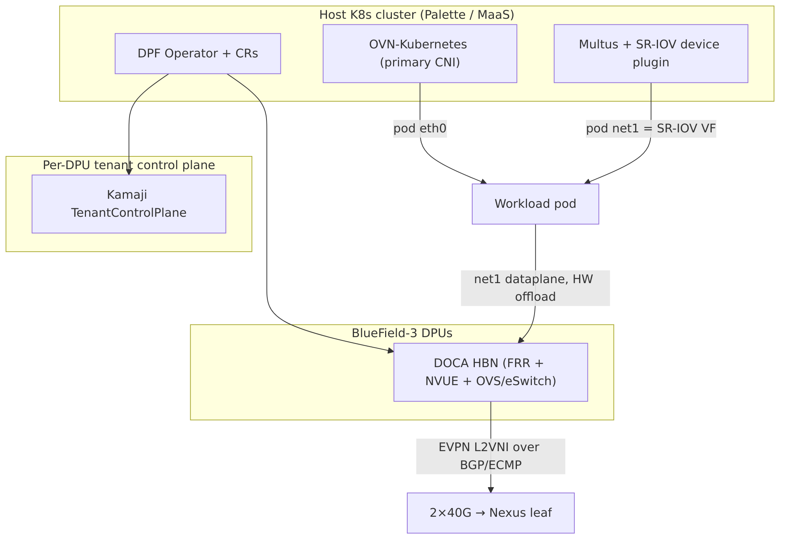
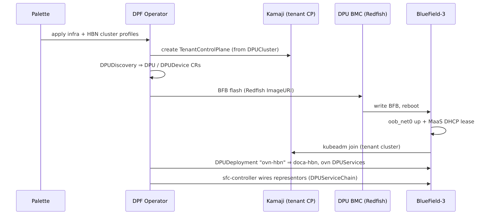
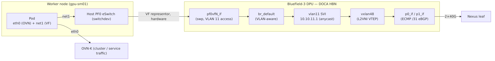
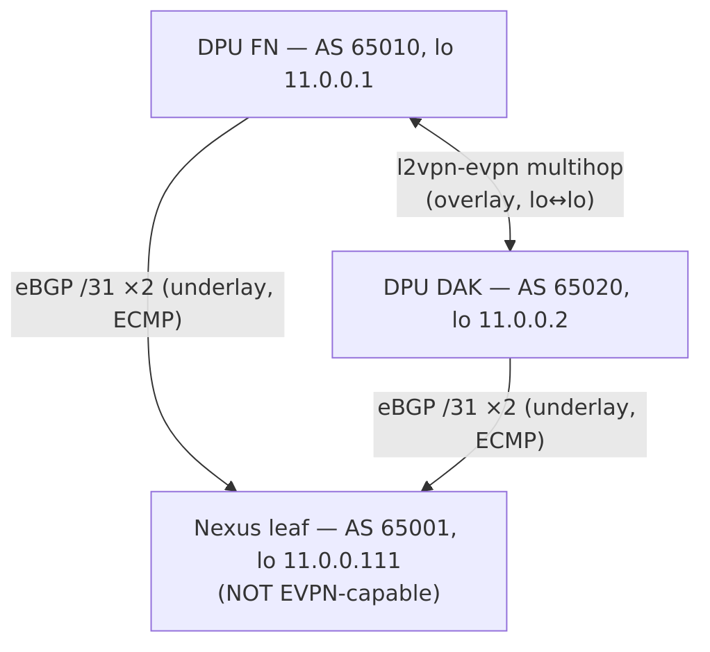
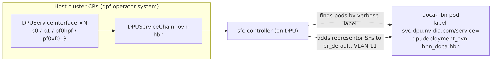
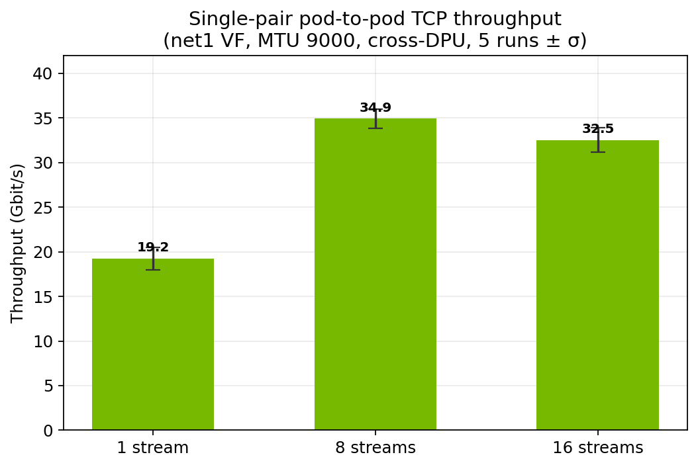
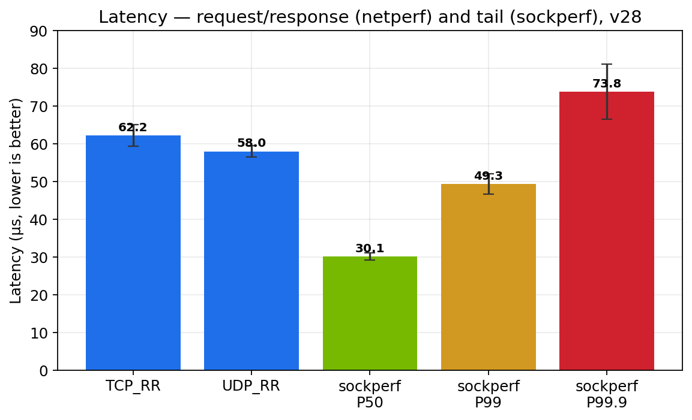
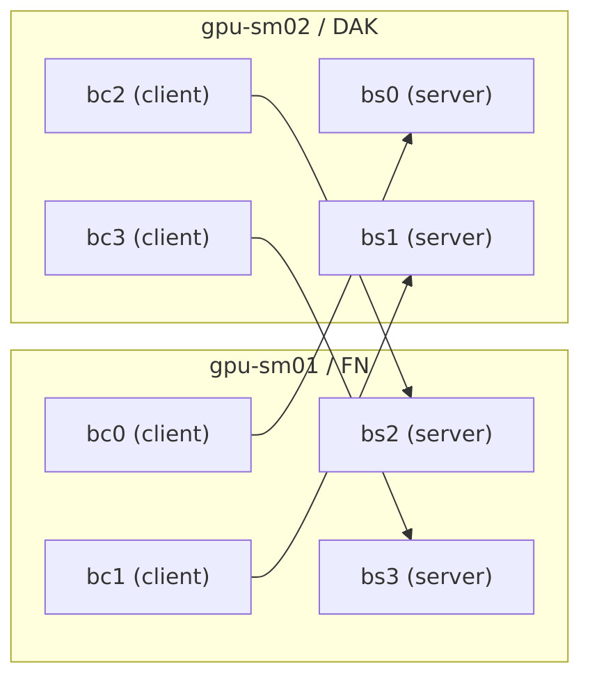
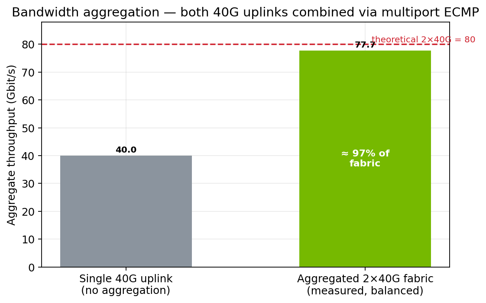
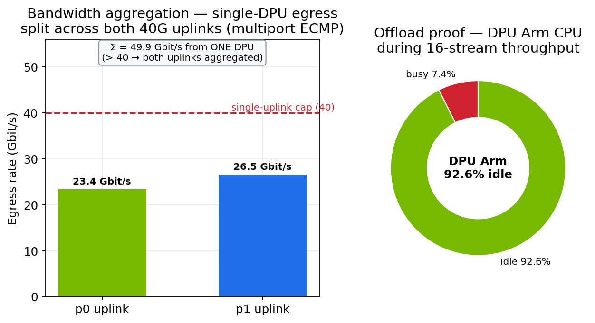

# Reference Architecture — DOCA HBN Pod-VF Hardware Offload on BlueField-3 via NVIDIA DPF and Spectro Cloud Palette

**Audience:** NVIDIA DOCA / DPF engineering, Spectro Cloud field engineering, and platform architects deploying accelerated Kubernetes on BlueField DPUs.
**Scope:** End-to-end design of a DPF Zero-Trust (ZT) provisioned cluster running DOCA HBN (EVPN L2VNI) with **pod-VF hardware eSwitch offload**, delivered as Spectro Cloud Palette cluster profiles on MaaS-managed bare metal. Includes the target workload profile, the full durable-fix catalog, and a benchmarking section (single-pair, bandwidth aggregation across both 40 GbE uplinks, and multiport ECMP verification).
**Platform versions:** DPF v25.10.1, DOCA HBN (BlueField-3, DOCA 2.x BSP), OVN-Kubernetes primary CNI, Spectro Cloud Palette (edge-native/MaaS), Kamaji tenant control planes.

> **Diagram note.** Diagrams are provided as Mermaid fenced blocks (render on GitHub and in Mermaid-aware Markdown→PDF pipelines, e.g. `pandoc` with `mermaid-filter`, or `mmdc` pre-render) and, for the fabric, additionally as monospace ASCII that renders in any PDF converter.

---

## Table of contents

1. [Solution overview](#1-solution-overview)
2. [Workload profile](#2-workload-profile)
3. [Physical and logical topology](#3-physical-and-logical-topology)
4. [DPF Zero-Trust provisioning architecture](#4-dpf-zero-trust-provisioning-architecture)
5. [Dataplane architecture — pod-VF offload](#5-dataplane-architecture--pod-vf-offload)
6. [DOCA HBN EVPN design](#6-doca-hbn-evpn-design)
7. [Service Function Chaining (SFC) wiring](#7-service-function-chaining-sfc-wiring)
8. [Multiport eSwitch and uplink ECMP](#8-multiport-eswitch-and-uplink-ecmp)
9. [Spectro Cloud Palette profile architecture](#9-spectro-cloud-palette-profile-architecture)
10. [Durable-fix catalog](#10-durable-fix-catalog)
11. [Benchmarking](#11-benchmarking)
12. [Operational runbook and troubleshooting](#12-operational-runbook-and-troubleshooting)
13. [Appendices — reference tables and config](#13-appendices)

---

## 1. Solution overview

This architecture delivers a **customer-realistic accelerated networking pattern**: a workload pod keeps its ordinary OVN-Kubernetes `eth0` for cluster/service traffic, and additionally receives an **SR-IOV Virtual Function as a secondary interface (`net1`)** whose entire dataplane is **hardware eSwitch-offloaded** on the BlueField-3 DPU, switched and routed by **DOCA HBN** across an **EVPN/VXLAN L2VNI** overlay on a BGP/ECMP underlay. The DPU Arm cores are **not in the packet path** — the offload is the defining property, and is verified empirically (§11.4).



*Figure 1 — System context: Palette/DPF provisioning, host CNI, and the DPU dataplane.*

Three layers compose the solution:

| Layer | Technology | Role |
|-------|-----------|------|
| **Provisioning / lifecycle** | Spectro Cloud Palette (edge-native, MaaS) + DPF Zero-Trust | Deploys the host cluster, flashes DPUs (BFB), stands up per-tenant Kamaji control planes, reconciles DPUDeployments |
| **Host CNI** | OVN-Kubernetes (primary) + Multus + SR-IOV device plugin | Pod `eth0` (OVN) and pod `net1` (SR-IOV VF) |
| **DPU dataplane** | DOCA HBN (FRR + NVUE + OVS/eSwitch) | EVPN L2VNI overlay, BGP underlay, hardware VF forwarding |

**Why pod-VF (and not host-PF or pod-eth0 offload):** the pod-VF model matches how customers actually consume accelerated networking — the primary CNI is untouched, and only a designated high-throughput interface is offloaded. It is the SR-IOV VF (not the pod's OVN `eth0`) whose representor is chained into HBN; `eth0` continues to ride OVN-K normally.

---

## 2. Workload profile

This section characterizes the workloads this architecture is built for, so architects can decide fit and size the fabric.

### 2.1 Target workloads

Pod-VF hardware offload is for **east-west-heavy, throughput- and/or tail-latency-sensitive** workloads that would otherwise burn host CPU in a software datapath (kernel/OVS). Representative classes:

| Workload class | Why pod-VF offload fits |
|----------------|-------------------------|
| **AI/ML data movement** — distributed training gradient/parameter sync, inference fan-out, feature-store reads | Elephant flows, jumbo frames, multiple concurrent connections; host cores must stay free for GPU feeding, not packet processing |
| **Disaggregated storage** — NVMe-oF, distributed FS (Lustre/GPFS/Ceph), object backends | Sustained bulk transfer at low CPU; jumbo MTU; predictable tail latency |
| **Telco / NFV user plane** — UPF, CU/DU, SBC/media | Deterministic latency and PPS at scale; VF-per-function; line-rate forwarding off-CPU |
| **HPC / MPI** | Many parallel flows, large messages, latency-sensitive collectives |
| **Market data / low-latency messaging** | Tight P99/P99.9 tail budgets; consistent forwarding |
| **Media / video pipelines, backup/replication** | Long-lived elephant flows; sustained multi-tens-of-Gbit throughput |

### 2.2 Traffic characteristics (design assumptions)

- **Flow profile:** predominantly **elephant flows**; multiple concurrent flows are required to (a) fill a 40G+ uplink and (b) provide ECMP entropy across the two uplinks. A single TCP flow tops ~33 Gbit/s (§11.2) — that is a per-flow ceiling, not the fabric.
- **Frame size:** **jumbo (MTU 9000)** end-to-end is assumed; fabric carries 9216 to leave VXLAN headroom. Sub-1500-byte single-flow UDP is CPU-bound in the pod and is *not* a fabric measure.
- **Directionality:** the fabric is symmetric; to saturate it you must **spread clients across both workers** (see the incast lesson, §11.3).
- **Isolation model:** the HBN L2VNI is a **flat tenant L2 domain** (`10.10.11.0/24`). Micro-segmentation/NetworkPolicy must be applied on `eth0` (OVN-K) or in the application — **not** expected on `net1`.

### 2.3 When *not* to use pod-VF offload

- Strict per-operation latency budgets on **tiny single-flow request/response** where VXLAN encap overhead and single-uplink pinning dominate — offload still helps CPU but won't add fabric parallelism to one flow.
- Workloads that require **Kubernetes NetworkPolicy / service mesh enforcement on the accelerated interface** — that belongs on `eth0`.
- Very small pods with no throughput need — the VF and fabric complexity buy nothing.

### 2.4 Per-pod footprint and sizing

| Dimension | Value / guidance |
|-----------|------------------|
| Pod resource request | `nvidia.com/bf3_p0_vfs: "1"` (one VF per pod) |
| `net1` | SR-IOV VF, MTU 9000, IP from whereabouts `10.10.11.0/24` |
| Host CPU cost of dataplane | ~0 (VF forwarded in HW; DPU Arm ~92% idle under load, §11.4) |
| VFs available | 4 created by default per PF0; nvconfig `NUM_OF_VFS=46` headroom |
| Per-DPU uplink capacity | 2 × 40 GbE = **80 Gbit/s** aggregated via multiport ECMP (§8) |
| Per-flow ceiling | ~33 Gbit/s (single TCP flow / single pod TCP stack) |
| Bandwidth aggregation (measured) | **77.72 Gbit/s** ≈ 97% of 2×40 GbE, balanced across both workers (§11.3) |

**Rule of thumb:** provision enough pods/flows to exceed the per-flow ceiling, and **balance senders and receivers across both workers**; a single busy sender can still exceed one uplink because multiport ECMP hashes its VXLAN across both (§11.3).

### 2.5 Benchmark → workload mapping

| Benchmark (§11) | Real-world question it answers |
|-----------------|-------------------------------|
| Single-pair TCP (1/8/16 streams) | Per-flow / per-pod throughput SLA for one workload instance |
| Bandwidth aggregation (balanced pairs) | Multi-pod / multi-tenant **fabric capacity** — both 40G uplinks combined |
| Multiport PHY split | Is bandwidth aggregation working? (one busy VTEP spread across both uplinks) |
| UDP 64-byte PPS | Small-packet / control-plane / telco user-plane density |
| netperf TCP_RR / sockperf tail | Latency-SLA workloads (messaging, market data, RPC) |
| netperf TCP_CRR | Connection churn (short-lived RPC, serverless, web tiers) |
| DPU Arm idle under load | Host-CPU savings — the economic case for offload |

---

## 3. Physical and logical topology

### 3.1 Nodes

| Node | Role | DPU | DPU serial | AS (DPU) | EVPN loopback |
|------|------|-----|-----------|----------|---------------|
| `gpu-sm01` | Worker | BlueField-3 ("FN") | `mt24326005fn` | 65010 | 11.0.0.1 |
| `gpu-sm02` | Worker | BlueField-3 ("DAK") | `mt2439600dak` | 65020 | 11.0.0.2 |
| `dpf-ctrl` (VM) | Tenant control-plane host | — | — | — | — |

The Kamaji **tenant** control plane for the DPU cluster runs off-worker (on a VM node) to avoid the circular dependency where the control plane needed to admit DPUs lives on a node that is itself being converted to a DPU host.

### 3.2 Fabric

```
                         Cisco Nexus leaf  (AS 65001, loopback 11.0.0.111)
                        Eth1/23   Eth1/24   Eth1/25   Eth1/26
                          |         |         |         |
             routed /31 eBGP (all four uplinks are L3, no switchports)
                          |         |         |         |
                 172.16.97.240/.241  .248/.249   (per /31 pair)
                          |         |         |         |
                 p0        p1       p0        p1
              +----------------+  +----------------+
              |  BF3  "FN"     |  |  BF3  "DAK"    |
              |  gpu-sm01      |  |  gpu-sm02      |
              |  AS 65010      |  |  AS 65020      |
              |  lo 11.0.0.1   |  |  lo 11.0.0.2   |
              +----------------+  +----------------+
                    2×40 GbE            2×40 GbE
```

- **All four uplinks are routed `/31` eBGP point-to-point links** (no L2 switchports). Each DPU peers eBGP with the leaf on both `p0` and `p1` and installs **ECMP** underlay routes.
- On the FN DPU the uplink SWPs carry: `p0_if = 172.16.97.241/31`, `p1_if = 172.16.97.249/31` (leaf side `.240` / `.248`).
- **DPU-to-DPU EVPN** is a **direct multihop `l2vpn-evpn` session between the two DPU loopbacks** (`11.0.0.1 ↔ 11.0.0.2`), reached over the underlay. This is deliberate: the leaf in this environment is **not EVPN-capable** (`l2vpn-evpn` returns NoNeg), so the overlay is stretched DPU-to-DPU rather than leaf-spine.

### 3.3 Overlay tenant network

| Property | Value |
|----------|-------|
| Tenant L2 subnet | `10.10.11.0/24` (flat, stretched across both DPUs) |
| VLAN (access, VF representors) | `11` |
| L2VNI | VXLAN, VNI mapped to VLAN 11 |
| Anycast SVI (default gateway) | `10.10.11.1` (identical on both DPUs) |
| Pod `net1` MTU | **9000** (jumbo) |
| Fabric MTU (`vlan11`, `vxlan48`, `br_default`) | **9216** (VXLAN headroom: 9000 + 50 B < 9216) |
| IPAM | whereabouts (cluster-wide), range `10.10.11.0/24` |

---

## 4. DPF Zero-Trust provisioning architecture

DPF ZT keeps DPU credentials and the DPU-side Kubernetes out of the host cluster's trust domain.



*Figure 2 — DPF Zero-Trust provisioning sequence.*

### 4.1 Critical dependencies and where they break

- **oob_net0 carrier at first boot.** DPU join requires `oob_net0` up with a MaaS DHCP lease so `network-online.target` fires and the kubeadm join unit runs. After a BFB flash the PHY frequently comes up **admin-up but carrier-down**; `ip link set oob_net0 up` cannot revive a dead carrier — only a **power-cycle** re-initialises the PHY. Both a boot-time `dpf-oob-fixup` service (admin-state) and a Redfish auto-repower CronJob (carrier) are required (§10).
- **DMS → API resolution.** The per-DPU DMS pod is `hostNetwork` + `ClusterFirstWithHostNet`, so it resolves the host-cluster API endpoint via CoreDNS (`10.96.0.10`). On the Palette OVN-K build, hostNetwork pods on workers **cannot reach ClusterIP services** (OVN gateway masquerade defect), so the DMS times out and the DPU never registers. The fix injects the API mapping into the DMS `/etc/hosts` using the apiserver ClusterIP `10.96.0.1`, which *is* reachable from hostNetwork because the apiserver is host-network-backed (§10).
- **Kamaji TCP replica count.** The tenant control-plane Deployment defaults to 2 replicas, which will not schedule on a single 4-CPU CP VM; it must be pinned to 1.
- **Tenant CA propagation to ovn-dpu.** The `DPUServiceCredentialRequest` can write the *host* cluster CA (not the tenant Kamaji CA) into `ovn-dpu.KUBERNETES_CA_DATA`, causing x509 failures in `doca-ovnkube-controller`; and the ovn-dpu config may ship `k8s_apiserver=https://:6443` (empty host) → informer sync failure (patch to `https://10.96.0.1:443`).

---

## 5. Dataplane architecture — pod-VF offload

### 5.1 Packet path



*Figure 3 — Pod-VF dataplane packet path (net1 hardware-offloaded through HBN).*

- The pod's `net1` is an SR-IOV **VF of the host-facing PF0**. In switchdev mode each host VF has a **representor on the DPU** named `pf0vfN_if`.
- HBN places every `pf0vfN_if` as an **access port on VLAN 11**, which maps to the **L2VNI**. Traffic from the pod's VF is switched in the BF3 eSwitch and VXLAN-encapsulated **in hardware** — the Arm cores never see the data plane.
- **`eth0` is untouched** — it remains a normal OVN-K port. Only `net1`'s VF representor is chained into HBN.

### 5.2 Host-side enablement (all from the profile)

- **VF creation:** a DaemonSet writes `sriov_numvfs` on PF0. PF0 is detected **dynamically** (netdev with `phys_port_name == p0` **and** `sriov_totalvfs > 0`) — never hardcoded, because the PF netdev name is non-deterministic across reprovisions (`eth0`, `enp14s0f0np0`, `enp<slot>s0f0np0`).
- **VF visibility:** each VF netdev is brought `up` (via the PF's `device/virtfn*` links) so the SR-IOV device plugin's `netDeviceProvider` (which walks `/sys/class/net` and skips DOWN-only devices) enumerates them.
- **Jumbo MTU:** a VF cannot exceed its parent PF's MTU, so the DaemonSet raises **PF0 to 9000 on every loop** (not just at VF creation) and sets each VF to 9000. Without this, the NAD's `mtu` silently fails and `net1` comes up at 1500 — the single largest throughput regression observed (§11.5).
- **Device-plugin rescan:** the SR-IOV device plugin scans once at start, often **before** the VFs exist, and never re-scans → 0 allocatable devices. A kicker DaemonSet restarts the plugin when `PF0 numvfs > 0` but the resource pool reports 0.

### 5.3 NetworkAttachmentDefinition (net1)

```jsonc
{
  "cniVersion": "0.3.1",
  "type": "sriov",
  "name": "hbn-fabric",
  "ipam": { "type": "whereabouts", "range": "10.10.11.0/24" },
  "mtu": 8900
}
```

The pod requests `nvidia.com/bf3_p0_vfs: "1"` and annotates `k8s.v1.cni.cncf.io/networks: hbn-fabric`.

---

## 6. DOCA HBN EVPN design



*Figure 4 — HBN EVPN control plane: eBGP /31 underlay + DPU-to-DPU l2vpn-evpn overlay.*

### 6.1 Underlay (BGP, routed /31 + ECMP)

Each DPU runs FRR (via HBN/NVUE) and establishes **two eBGP sessions to the leaf** — one per uplink `/31`. Both are used with ECMP, giving the VTEP two equal-cost paths to remote loopbacks.

```
DPU FN (AS 65010):
   neighbor 172.16.97.240 remote-as 65001   (via p0_if 172.16.97.241/31)
   neighbor 172.16.97.248 remote-as 65001   (via p1_if 172.16.97.249/31)
   loopback 11.0.0.1/32 advertised into underlay
```

### 6.2 Overlay (EVPN L2VNI, DPU-to-DPU)

Because the leaf is not EVPN-capable, the overlay is a **direct multihop `l2vpn-evpn` session between the two DPU loopbacks**:

```
DPU FN:   neighbor 11.0.0.2 remote-as 65020   (l2vpn-evpn, multihop, update-source lo)
DPU DAK:  neighbor 11.0.0.1 remote-as 65010   (l2vpn-evpn, multihop, update-source lo)
```

- **L2VNI:** VLAN 11 ⇄ VNI. VF representors are access ports on VLAN 11; MACs learned there are advertised as **EVPN type-2 (MAC/IP)** routes to the peer DPU; the VNI is advertised as **type-3 (IMET)**.
- **Anycast SVI:** `vlan11` carries `10.10.11.1/24` **identically on both DPUs** (anycast gateway), so any pod uses the same default gateway regardless of which DPU it lands on. Pods are L2-adjacent in the flat `/24` across the VXLAN.
- **Cross-DPU pod traffic:** pod-on-FN → `pf0vfN_if` (VLAN 11) → VXLAN encap (VTEP 11.0.0.1) → underlay ECMP over p0/p1 → leaf → DAK VTEP 11.0.0.2 → decap → `pf0vfM_if` → pod-on-DAK. All in hardware.

### 6.3 Interface inventory (per DPU, inside the HBN pod)

| Interface | Type | Address / role | MTU |
|-----------|------|----------------|-----|
| `lo` | loopback | `11.0.0.1/32` (VTEP source) | 65536 |
| `p0_if`, `p1_if` | swp (uplink) | `.241/31`, `.249/31` eBGP | 9000 |
| `pf0hpf_if` | swp | host PF0 representor (`10.0.120.3/29`) | 9000 |
| `pf0vf0_if`..`pf0vf3_if` | swp | pod VF representors, VLAN 11 access | 9000 |
| `vlan11` | SVI | `10.10.11.1/24` anycast GW | 9216 |
| `vxlan48` | vxlan | L2VNI VTEP | 9216 |
| `br_default` | bridge | VLAN-aware bridge | 9216 |

---

## 7. Service Function Chaining (SFC) wiring

The representor-to-HBN wiring is **declarative**, driven by DPF `sfc-controller` from two CR families in the host cluster.



*Figure 5 — SFC wiring: DPUServiceInterface → ServiceChain → sfc-controller → HBN.*

### 7.1 The serviceID label (authoritative, high-impact)

`sfc-controller` wires SFs by locating the `doca-hbn` pods via the label:

```
svc.dpu.nvidia.com/service = dpudeployment_ovn-hbn_doca-hbn
```

- **The verbose form is correct and is the default.** Do **not** "normalize" it to plain `doca-hbn`. A label-rewriter that shortens it causes `sfc-controller` to fail to find the pods → representors are never added to `br_default` → SFs unwired → BGP stays `Active` → **no fabric**. This exact failure mode has been root-caused twice; the corrective action is to remove any such rewriter and rely on the default verbose label.

### 7.2 Correct offload wiring (vs. a common wrong pattern)

- **Correct:** `DPUServiceInterface(interfaceType: vf, pfID+vfID)` → `ServiceChain` → HBN `pf0vfN_if` swp on VLAN 11 (a fabric port HBN actually switches/routes).
- **Wrong:** raw `ovs-vsctl add-port br-hbn pf0hpf` with no ServiceChain — HBN will not route it; it offloads nothing. The chain, not a raw OVS port, is what programs the eSwitch.

---

## 8. Multiport eSwitch and uplink ECMP

A single VTEP's **self-originated VXLAN** binds to a single uplink unless the mlx5 **multiport eSwitch** (`esw_multiport`) is enabled — the multipath LAG stays disabled and the overlay uses only **one** 40 GbE uplink (~39 Gbit/s ceiling). With multiport enabled, the eSwitch hashes VXLAN flows across **both** uplinks (verified ~2× in §11.3).

### 8.1 Requirements and constraints

- Must be set **before the HBN dataplane starts**, and **takes effect on a clean init** — so it is a **boot oneshot ordered before `kubelet`/`containerd`**, baked into the DPUFlavor `configFiles`. The DPU's first boot after the BFB flash is that clean init.
- **Never toggle on a live HBN** — flipping `esw_multiport` at runtime drops BGP.
- Firmware prerequisite `LAG_RESOURCE_ALLOCATION=1` is already set on BF3.

### 8.2 PCI detection (dynamic, not hardcoded)

The enablement script detects the two uplink PFs by `phys_port_name` (`p0`/`p1`) → owning PCI function, with the known BF3 PCIs (`0000:03:00.0` / `.1`) only as a fallback. This mirrors the VF-script pattern and keeps the service portable across DPU models/slots:

```bash
find_pci() {  # $1 = p0|p1  → echoes owning PCI function
  for d in /sys/class/net/*; do
    [ "$(cat "$d/phys_port_name" 2>/dev/null)" = "$1" ] || continue
    pci=$(basename "$(readlink -f "$d/device")"); case "$pci" in 0000:*) echo "$pci"; return 0;; esac
  done; return 1
}
for pf in "$(find_pci p0)" "$(find_pci p1)"; do
  devlink dev eswitch set  pci/$pf mode switchdev
  devlink dev param   set  pci/$pf name esw_multiport value true cmode runtime
done
```

---

## 9. Spectro Cloud Palette profile architecture

The cluster is composed from **two cluster profiles**:

| Profile | Palette type | Purpose |
|---------|-------------|---------|
| **infra** (`infra-zt-longhorn`) | `cluster` (cloudType maas) | Base OS/k8s, Longhorn CSI, DPF operator + CRs (DPUCluster, DPUDiscovery, BMC creds), host CNI/zone-labeler, the re-embedded DPF manifests |
| **HBN add-on** (`hbn-ovn-v15`) | add-on | DPUFlavor (with boot-time configFiles), DPUDeployment `ovn-hbn`, DPUServiceInterfaces/Chains, host SR-IOV/multus, NAD, and the runtime durable fixes |

### 9.1 Palette behaviors every engineer must know

- **Palette reverts live patches.** The `spectro-palette-agent-reconcile` timer (not just Stylus) reconciles the cluster back to the *published* profile. **Any fix applied with `kubectl patch`/`edit` will be undone.** Every fix must live *in the profile* — this is the cardinal rule of this architecture.
- **Profile GET returns manifest name/UID refs without content.** A `GET /clusterprofiles/{uid}` lists manifests by name/UID but omits their body; the content lives at `spec.published.content` and is fetched per-manifest via `/clusterprofiles/{uid}/packs/{pack}/manifests/{manifestUid}`. Rebuilding a profile from a naive GET **silently drops manifest bodies** — this corrupted several infra rebuilds until the content endpoint was used.
- **Stale render cache.** Palette can serve a stale rendered manifest set; when a direct-apply is required to break a deadlock, pause `palette-controller-manager` first, then apply, then let it resume — otherwise the reconcile races the apply.
- **Profile update API:** `PUT /v1/spectroclusters/{uid}/profiles` with `{"profiles":[{"uid":"...","packValues":[]}]}`.

---

## 10. Durable-fix catalog

Every item below is baked into a profile so a fresh deploy is hands-off. This is the operational heart of the architecture.

| # | Fix (where) | Root cause | Mechanism |
|---|-------------|-----------|-----------|
| 1 | **dpf-oob-fixup** (DPUFlavor configFiles) | After BFB flash, `oob_net0` admin-down/late → `network-online.target` never fires → kubeadm join never runs | Boot service brings `oob_net0` up (search-path unit); + remove `/opt/dpf/joined_cluster_successfully` before any reset+rejoin |
| 2 | **dpu-oob-carrier-repower** (CronJob, */3) | oob PHY comes up **carrier-dead** after flash; admin-up can't fix it | Redfish `ForceRestart` on any DPU stuck at "DPU Cluster Config" whose oob IP doesn't ping; rate-limited via annotation |
| 3 | **dpf-esw-multiport** (DPUFlavor configFiles) | Single VTEP binds VXLAN to one uplink without `esw_multiport` | Boot oneshot before kubelet; enables multiport eSwitch on dynamically-detected uplink PFs (§8) |
| 4 | **host-bf3-sriov-vfs** (DaemonSet) | VFs absent/DOWN; VF MTU capped by PF; PF name non-deterministic | Detect PF0 by `phys_port_name=p0 + sriov_totalvfs>0`; create VFs; raise PF+VF to **9000 every loop**; bring VFs up |
| 5 | **sriov-dp-rescan-kicker** (DaemonSet) | SR-IOV device plugin scans once, before VFs exist → 0 allocatable | Restart the plugin when `numvfs>0` but pool reports 0 |
| 6 | **dms-api-hosts-fixer** (DaemonSet) | DMS (hostNetwork) can't reach CoreDNS ClusterIP (OVN gateway defect) → DPU never registers | Inject API endpoint → `10.96.0.1` into each DMS pod's `/etc/hosts` (apiserver ClusterIP *is* reachable from hostNetwork) |
| 7 | **kamaji-replicas=1** (in-profile) | TCP Deployment defaults to 2 replicas; won't fit single 4-CPU CP VM | Force `replicas=1` (also auto-unblocks tenant API TCP) |
| 8 | **Remove doca-hbn-label-fixer(-fast)** | Rewrote serviceID verbose→plain → `sfc-controller` can't find pods → fabric down | Deleted; default verbose label is correct (§7.1) |
| 9 | **Longhorn all-node** (`defaultNodeSelector.enable: false`) | Storage crammed onto too few nodes | Use all nodes for Longhorn |
| 10 | **host-ovnk-zone-labeler** (in CNI pack, not add-on) | Zone label applied too late (add-on layer) → worker flap | Moved to infra CNI pack so it lands early |
| 11 | **Re-embedded DPF manifests** (infra) | Palette GET dropped manifest bodies (§9.1) → empty DPUCluster/DPUDiscovery/BMC-creds | Recovered content via `spec.published.content` and re-embedded |
| 12 | **ovn-dpu CA / apiserver / NBDB-zone** | Host CA written instead of tenant Kamaji CA; empty apiserver host; NBDB zone mismatch | Corrected in profile (see §12) |
| 13 | **MaaS oob reservation creds** | Empty MaaS API creds → no oob lease → no join | MaaS API token baked into HBN vars |

---

## 11. Benchmarking

### 11.1 Methodology

- **Tools:** iperf3 (throughput/PPS), netperf (latency/conn-rate), sockperf (tail latency). **5 runs per benchmark**, reported as **mean ± population stdev**.
- **Workload:** pods on worker nodes, each with `net1` = SR-IOV VF at MTU 9000, cross-node/cross-DPU over the EVPN L2VNI. Client pod uses the peer pod's `net1` IP in the flat `10.10.11.0/24`.
- **Two regimes:** (a) **single pod-pair** — the per-flow/per-pod ceiling; (b) **bandwidth aggregation** — multiple balanced pod-pairs across both workers, exercising both 40 GbE uplinks per DPU via multiport ECMP.
- **Environment:** the authoritative standalone, hands-off deploy set (**infra v14 + HBN v28**); every result comes from profile-rendered configuration with **no live patching**. All figures below are from this single reference deployment.

### 11.2 Single-pair results (5 runs, mean ± stdev)

| # | Benchmark | Tool | Result |
|---|-----------|------|--------|
| 1 | TCP throughput, 1 stream | iperf3 | 19.22 ± 1.24 Gbit/s |
| 2 | TCP throughput, 8 streams | iperf3 | **34.91 ± 1.05 Gbit/s** |
| 3 | TCP throughput, 16 streams | iperf3 | 32.53 ± 1.38 Gbit/s |
| 4 | UDP throughput, max (`-b 0`) | iperf3 | 12.60 ± 1.39 Gbit/s (54% loss — single unpaced flow, pod-CPU-bound) |
| 5 | UDP 64-byte (PPS) | iperf3 | **383,557 ± 5,659 PPS** |
| 6 | UDP 1400-byte | iperf3 | 2.72 ± 0.06 Gbit/s |
| 7 | TCP request/response latency | netperf TCP_RR | **62.19 ± 2.92 µs** (16,075 tps) |
| 8 | UDP request/response latency | netperf UDP_RR | 57.98 ± 1.44 µs |
| 9 | Sustained connections/sec | netperf TCP_CRR | 3,145 ± 179 conn/s |
| 10 | Tail latency | sockperf | P50 **30.11** / P99 **49.33** / P99.9 **73.78** µs |



*Figure 7 — Single-pair pod-to-pod TCP throughput (net1 VF, MTU 9000, cross-DPU; 5 runs ± σ).*



*Figure 8 — Request/response (netperf) and tail (sockperf) latency.*

**Interpretation.** Single-pair TCP tops ~33–35 Gbit/s — the ceiling is one VXLAN flow's entropy landing on one uplink plus a single pod's TCP stack, **not** the fabric. The UDP throughput rows (max, 1400 B) are single unpaced flows, pod-CPU-bound, and inherently noisy — not a fabric measure.

### 11.3 Bandwidth aggregation — both 40 GbE uplinks combined

Each DPU has two 40 GbE uplinks to the leaf. **Multiport eSwitch (§8) aggregates their bandwidth**: a single VTEP's self-originated VXLAN is ECMP-hashed across both uplinks, so the fabric delivers ~2×40 = **80 Gbit/s** rather than a single 40 GbE path. Aggregate load is generated with balanced pod-pairs — 2 clients + 2 servers per worker, cross-paired (Figure 6) — so both DPUs egress on both uplinks simultaneously.



*Figure 6 — Balanced benchmark topology (2 clients + 2 servers per node, cross-paired).*



*Figure 9 — Measured aggregate bandwidth vs a single 40 GbE uplink; ceiling is 2×40 = 80 Gbit/s.*

**Measured aggregate: 77.72 Gbit/s** — ≈ **97% of the 2×40 GbE (80 Gbit/s)** available to the DPU pair, with retransmits ~0. The direction split is symmetric (sm01→sm02 **39.63** / sm02→sm01 **38.08** Gbit/s). The residual gap to 80 is host-side (iperf3 CPU and each worker's PF sharing TX and RX), **not** the HBN fabric.

> **Methodology note.** Bandwidth aggregation requires senders and receivers **balanced across both workers**. Concentrating all senders on one node collapses the measurement onto a single DPU's egress (incast) and does not exercise the aggregated fabric.

#### Multiport ECMP — direct hardware proof of aggregation

During a **single-DPU (FN) egress-only** burst, the **hardware PHY tx counters** of the two physical uplinks were sampled (`/sys/class/net/pN/statistics/tx_bytes` on the DPU host — these count HW-offloaded traffic; the software netdev/ethtool counters do **not**, which is itself the offload signature):



*Figure 10 — Left: single-DPU egress split across both 40 GbE uplinks (bandwidth aggregation). Right: DPU Arm CPU during throughput (offload).*

```
p0 (0000:03:00.0)  PHY-TX:  35.11 GB  (47%)  ≈ 23.4 Gbit/s
p1 (0000:03:00.1)  PHY-TX:  39.79 GB  (53%)  ≈ 26.5 Gbit/s
  Σ  74.9 GB in 12 s  ≈  49.9 Gbit/s from ONE DPU
```

~50 Gbit/s out of a single DPU is **physically impossible on one 40 GbE uplink**, and the split is a near-even 47/53. **Multiport ECMP aggregates both uplinks — and it comes up from the baked boot service on a fresh deploy, with no live patching.**

### 11.4 Offload verification

During sustained 16-stream throughput the **DPU Arm cores measured 92.6% idle** (16 cores, ~7.4% busy; `/proc/stat` delta on the DPU — Figure 10, right). Combined with the near-zero software byte counters (§11.3), this confirms the BF3 eSwitch forwards the VF dataplane **in hardware** — the pod stays on the worker and the Arm is not in the packet path. **This is the economic case for offload: line-rate-class throughput at ~0 host/DPU CPU.**

### 11.5 Jumbo MTU (throughput requirement)

Jumbo end-to-end is a **hard requirement**. A VF cannot exceed its parent PF's MTU, so PF0 **and** the VFs must be at 9000 for `net1` to come up jumbo; if PF0 is left at 1500 the NAD's `mtu` silently fails, `net1` falls back to 1500, and every VXLAN frame fragments — cutting 8-stream throughput to ~28 Gbit/s. The `host-bf3-sriov-vfs` DaemonSet raises PF0 and every VF to 9000 on every loop (baked), so `net1` comes up 9000 with no manual step and the 8-stream result reaches **34.9 Gbit/s**. Fabric MTU has VXLAN headroom (`vlan11`/`vxlan48` = 9216; inner 9000 + 50 B = 9050).

### 11.6 Reproducing

```bash
# net1 jumbo check (should be 9000 on every pod, from the profile)
kubectl -n bench exec <pod> -- cat /sys/class/net/net1/mtu

# single pair
iperf3 -c <peer net1 IP> -t 10 -P 16 -J                 # throughput
netperf -H <peer> -t TCP_RR -l 10 -- -o transaction_rate,mean_latency
sockperf pp --tcp -i <peer> -p 11111 -t 10

# balanced aggregate: 2 clients + 2 servers per node, 4 pairs concurrent, sum sum_received
# multiport proof: read /sys/class/net/p0|p1/statistics/tx_bytes on the DPU host before/after
#                  a single-DPU egress burst; both must increment substantially
```

---

## 12. Operational runbook and troubleshooting

| Symptom | Root cause | Resolution |
|---------|-----------|------------|
| DPU stuck at "DPU Cluster Config" | `oob_net0` carrier dead after flash | Auto-repower CronJob (#2); or manual Redfish `ForceRestart` via DPU BMC |
| DPU never registers, DMS DNS timeouts | hostNetwork pod can't reach CoreDNS ClusterIP (OVN gateway defect) | dms-api-hosts-fixer (#6); verify `10.96.0.1` reachable from hostNetwork |
| BGP sessions stay `Active`, no fabric | representors unwired — usually serviceID relabelled verbose→plain | Ensure verbose `dpudeployment_ovn-hbn_doca-hbn` label; remove any label-rewriter (#8) |
| `doca-ovnkube-controller` x509 errors | ovn-dpu got host CA, not tenant Kamaji CA | Correct `KUBERNETES_CA_DATA`; ensure DPUServiceCredentialRequest uses tenant CA |
| ovn-dpu informer sync fails | config ships `k8s_apiserver=https://:6443` (empty host) | Patch CM to `https://10.96.0.1:443` (bake in profile) |
| doca-ovnkube-controller crash on NBDB zone | NBDB `zone=<short DPU hostname>`, `config=global` mismatch | `ovn-nbctl set NB_Global . name=global` after pod restart (bake) |
| DPU cniprovisioner needs br-comm-ch | Nothing in DPF creates the `br-comm-ch` bridge (OOB IP + carrier + host route) | Create bridge with OOB IP + carrier + host route to gw (bake); BMC SOL to fix live |
| net1 comes up 1500, throughput ~28G | PF0 at MTU 1500 caps the VF | host-bf3-sriov-vfs raises PF+VF to 9000 (#4) |
| Aggregate stuck ~40G / single uplink | multiport eSwitch not active | Verify `esw_multiport` boot service ran; check per-uplink PHY counter split (§11.3) |
| 0 allocatable `bf3_p0_vfs` | device plugin scanned before VFs existed | sriov-dp-rescan-kicker (#5) |
| Everything reverts after a fix | Palette reconcile timer | Put the fix in the profile; never live-patch (§9.1) |
| DPU clock skew after reboot | RTC drift → TLS/x509 fails | Correct via IPMI SOL / chrony; watch for br-comm-ch /24 oob shadow |

---

## 13. Appendices

### 13.1 Address / AS reference

| Item | Value |
|------|-------|
| Leaf AS / loopback | 65001 / 11.0.0.111 |
| FN DPU AS / loopback | 65010 / 11.0.0.1 |
| DAK DPU AS / loopback | 65020 / 11.0.0.2 |
| FN uplinks (p0/p1) | 172.16.97.241/31, 172.16.97.249/31 (leaf .240/.248) |
| Tenant subnet / VLAN / SVI | 10.10.11.0/24 / VLAN 11 / 10.10.11.1 (anycast) |
| pf0hpf_if | 10.0.120.3/29 |
| Tenant (DPU) cluster API | https://172.16.30.240:31611 (Kamaji NodePort) |
| Host apiserver ClusterIP | 10.96.0.1:443 (reachable from hostNetwork) |
| CoreDNS ClusterIP | 10.96.0.10 (NOT reachable from worker hostNetwork — OVN gateway defect) |
| DPU BMC | Redfish `https://<bmc>/redfish/v1/Systems/Bluefield/Actions/ComputerSystem.Reset` |

### 13.2 Interface / PCI map (BF3 host + DPU)

| Where | Interface | Notes |
|-------|-----------|-------|
| Host (worker) | PF0 `enp14s0f0np0` (name varies) | `phys_port_name=p0`, `sriov_totalvfs>0`; raise to MTU 9000 |
| Host (worker) | VF netdevs (virtfn*) | pod `net1`; MTU 9000; brought up for device-plugin enum |
| DPU | `p0` / `p1` | physical uplinks, PCI `0000:03:00.0` / `.1` (detect dynamically) |
| DPU (HBN) | `pf0vf0_if`..`pf0vf3_if` | VF representors, VLAN 11 access |
| DPU (HBN) | `p0_if` / `p1_if` | uplink SWPs, eBGP /31 |
| DPU (HBN) | `vlan11` / `vxlan48` / `br_default` | SVI / L2VNI VTEP / VLAN-aware bridge (MTU 9216) |

### 13.3 Key CRs

- `DPUCluster`, `DPUDiscovery`, `DPUDevice`, `DPU` (provisioning.dpu.nvidia.com)
- `DPUFlavor` (boot-time `configFiles`: oob-fixup, esw-multiport)
- `DPUDeployment` `ovn-hbn`
- `DPUServiceInterface` (`p0`, `p1`, `pf0hpf`, `pf0vf0..3`), `DPUServiceChain` (`ovn-hbn`)
- `DPUServiceCredentialRequest` (ovn-dpu tenant CA — watch the CA bug)
- Host: `NetworkAttachmentDefinition` (sriov, whereabouts), SR-IOV device plugin config

### 13.4 Verification one-liners

```bash
# Fabric up? (in the doca-hbn pod)
nv show interface | grep -E 'p0_if|p1_if|vlan11|vxlan48'      # up, MTUs
vtysh -c 'show bgp l2vpn evpn summary'                         # neighbors Established
vtysh -c 'show bgp summary'                                    # underlay /31 sessions

# VF representors on VLAN 11 access?
bridge vlan show | grep pf0vf                                  # 11 PVID Egress Untagged

# serviceID label correct (verbose)?
kubectl -n dpf-operator-system get pods -l svc.dpu.nvidia.com/service=dpudeployment_ovn-hbn_doca-hbn

# Offload proof: DPU Arm idle during load
awk '/^cpu /{print $5/($2+$3+$4+$5+$6+$7+$8)*100"% idle"}' /proc/stat

# Multiport proof: per-uplink HW PHY tx across a single-DPU egress burst
cat /sys/class/net/p0/statistics/tx_bytes /sys/class/net/p1/statistics/tx_bytes
```

---

*Reference deployment: cluster `dpf-hbn-ovn-v28`, profiles infra v14 + HBN v28. Benchmark artifacts: `results/pod-vf-evpn-hbn-v28/` (single-pair suite, bandwidth aggregation, multiport, DPU-idle).*
